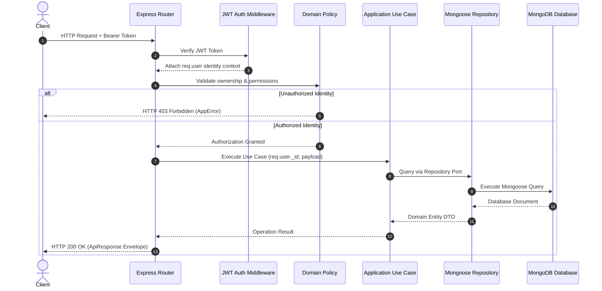

# JobPostingBackend

Enterprise Modular Monolith backend application for a job posting, student application, company management, and administrative moderation platform. Built with Node.js, Express, MongoDB (Mongoose), Redis, Zod, and Pino.

---

## Table of Contents

- [Project Overview](#project-overview)
- [Technology Stack](#technology-stack)
- [Features](#features)
- [Architecture](#architecture)
- [Domain Modules](#domain-modules)
- [Directory Structure](#directory-structure)
- [Request Lifecycle](#request-lifecycle)
- [Authentication](#authentication)
- [Authorization](#authorization)
- [Security Model](#security-model)
- [OTP Architecture](#otp-architecture)
- [Email Verification](#email-verification)
- [Redis Architecture](#redis-architecture)
- [Rate Limiting](#rate-limiting)
- [Caching](#caching)
- [Idempotency](#idempotency)
- [MongoDB & Repository Pattern](#mongodb--repository-pattern)
- [File Uploads](#file-uploads)
- [Email Infrastructure](#email-infrastructure)
- [Error Handling & API Responses](#error-handling--api-responses)
- [Complete API Reference](#complete-api-reference)
- [Pagination and Filtering](#pagination-and-filtering)
- [Business Workflows](#business-workflows)
- [Environment Variables](#environment-variables)
- [Local Development](#local-development)
- [NPM Scripts](#npm-scripts)
- [Docker Setup](#docker-setup)
- [Health Checks](#health-checks)
- [Graceful Shutdown](#graceful-shutdown)
- [Logging and Observability](#logging-and-observability)
- [CORS Security](#cors-security)
- [CI Pipeline](#ci-pipeline)
- [OpenAPI Specification](#openapi-specification)
- [Testing Strategy](#testing-strategy)
- [Production Deployment](#production-deployment)
- [Production Readiness](#production-readiness)
- [Known Risks and Limitations](#known-risks-and-limitations)
- [Production Security Checklist](#production-security-checklist)
- [Troubleshooting](#troubleshooting)
- [Developer Guidelines](#developer-guidelines)
- [Adding a New Module](#adding-a-new-module)
- [Adding a New Endpoint](#adding-a-new-endpoint)
- [Adding Infrastructure Ports](#adding-infrastructure-ports)
- [Change Management Workflow](#change-management-workflow)
- [Architecture Decisions](#architecture-decisions)
- [Documentation Map](#documentation-map)
- [Mermaid Architecture Diagram](#mermaid-architecture-diagram)
- [Mermaid Security Flow](#mermaid-security-flow)
- [Final Architecture Summary](#final-architecture-summary)

---

## Project Overview

`JobPostingBackend` provides a production-grade backend service powering a recruitment platform connecting **Students**, **Company Founders**, and **Platform Administrators**.

The repository has undergone an enterprise transformation into a **Modular Monolith** with clean architecture boundaries:
- **Domain Independence**: Business logic, policies, and entity interfaces are decoupled from HTTP frameworks (Express), database ODMs (Mongoose), cache services (Redis), and third-party storage/email providers.
- **Unified Infrastructure**: Centralized Redis singleton for Fixed-Window rate limiting, Cache-Aside performance caching, cryptographic OTP verification, and request idempotency.
- **Production Observability**: Structured JSON logging via Pino, request correlation IDs (`X-Request-ID`), multi-stage Docker builds, health probes, and graceful connection draining.

---

## Technology Stack

| Technology | Version / Specification | Purpose |
| :--- | :--- | :--- |
| **Node.js** | `>=20.0.0` (ESM `"type": "module"`) | Asynchronous JavaScript runtime environment |
| **Express** | `^4.19.2` | HTTP web server framework |
| **MongoDB / Mongoose** | Mongoose `^8.5.1` | Primary document database and ODM |
| **Redis / ioredis** | ioredis `^5.4.1` | Cache, OTP, rate limiting, and idempotency store |
| **Zod** | `^3.23.8` | Declarative request schema validation |
| **JSON Web Token** | `jsonwebtoken ^9.0.2` | Access and Refresh token authentication |
| **bcryptjs** | `^2.4.3` | Password hashing algorithm |
| **Pino / pino-http** | `^9.3.0` | High-performance structured JSON logging |
| **Multer / Cloudinary** | Cloudinary `^2.3.0` | Multipart file uploads and cloud media management |
| **Jest / Supertest** | Jest `^29.7.0` | Unit and API integration testing suite |
| **Docker** | Engine `29.3.0` / Compose `v5.1.0` | Containerized deployment runtime |
| **OpenAPI** | 3.0.3 Specification | Complete API specification contract |

---

## Features

- **Authentication & Security**: Email/Password registration, JWT Access + Refresh token rotation, HTTP-only cookies, SHA-256 OTP handling, and account enumeration protection.
- **Role-Based Authorization**: Fine-grained role checks (`STUDENT`, `COMPANY`, `ADMIN`) and domain policies preventing IDOR, privilege escalation, and self-demotion.
- **User Management**: Student profile updates, account details management, avatar media uploads.
- **Company Management**: Founder company creation, public profiles, founder authorization checks, and recruitment dashboards.
- **Job Management**: Posting creation, search with pagination and text filter, job updating, and closing/deletion workflows.
- **Application Management**: Student job applications, resume media submissions, duplicate application prevention via idempotency keys, withdrawal, and company review queues.
- **Student Document Verification**: Document upload, verification status tracking (`PENDING`, `VERIFIED`, `REJECTED`), and administrative review workflows.
- **Admin & Moderation**: Dedicated admin dashboard stats, demoting/removing admins, blocking/unblocking users and companies, content moderation for jobs and applications.
- **Infrastructure Services**: Centralized Redis singleton, Fixed-Window rate limiting (`INCR` + `EXPIRE`), Cache-Aside strategy (`SCAN` wildcard invalidation), `SET NX EX` 30s idempotency reservation, `storagePort`, and `emailPort`.
- **Operational Excellence**: `/health/live` & `/health/ready` probes, Pino structured logs, `X-Request-ID` correlation, signal handling (`SIGTERM`/`SIGINT`), and 100% test pass rate across 26 test suites.

---

## Architecture

The project enforces a 4-layer **Clean Architecture** pattern across all domain modules:

```text
Presentation Layer (Express Routes, Thin Controllers, Zod Middlewares)
        │
        ▼
Application Layer (Use Cases, Workflow Orchestration, DTOs)
        │
        ├──► Domain Layer (Entities, Policies, Repository Ports)
        │
        ▼
Infrastructure Layer (Mongoose Repositories, Redis Client, Storage & Email Adapters)
```

### Layer Responsibilities
- **Presentation (`src/modules/*/presentation/`)**: Validates request parameters via Zod, extracts identity context (`req.user`), invokes application use cases, and formats JSON responses using `ApiResponse`.
- **Application (`src/modules/*/application/`)**: Enforces business orchestration workflows. Imports domain policies and repository ports. Has zero direct dependencies on Express, Mongoose, or Redis SDKs.
- **Domain (`src/modules/*/domain/`)**: Pure business logic, entity declarations, ownership rules (`DomainPolicy`), and repository interface contracts (`IRepository`). Has zero external framework imports.
- **Infrastructure (`src/modules/*/infrastructure/` & `src/infrastructure/`)**: Concrete implementations of repository ports (`MongoUserRepository`, `MongoCompanyRepository`), database connection managers, Redis caching, storage ports, and email ports.

---

## Domain Modules

| Module Directory | Primary Responsibility | Repository Ports | Domain Policies |
| :--- | :--- | :--- | :--- |
| `src/modules/auth/` | Credentials, JWT tokens, OTPs, Email Verification | `IUserRepository`, `IEmailVerificationRepository` | `EmailVerificationPolicy` |
| `src/modules/users/` | Student profiles & account settings | `IUserRepository` | `UserPolicy` |
| `src/modules/companies/` | Founder company creation & dashboards | `ICompanyRepository` | `CompanyPolicy` |
| `src/modules/jobs/` | Job postings, search, filters & lifecycle | `IJobRepository` | `JobPolicy` |
| `src/modules/applications/` | Application submission, reviews & resumes | `IApplicationRepository` | `ApplicationPolicy` |
| `src/modules/verification/` | Student document submission & verification | `IStudentVerificationRepository` | `StudentVerificationPolicy` |
| `src/modules/admin/` | Platform stats, user/company moderation & admin roles | `IAdminRepository`, `IModerationRepository` | `AdminPolicy`, `ModerationPolicy` |

---

## Directory Structure

```text
JobPostingBackend/
├── .github/
│   └── workflows/
│       └── ci.yml                   # GitHub Actions CI workflow
├── docs/
│   ├── openapi.yaml                 # OpenAPI 3.0.3 Specification contract
│   ├── CHANGELOG.md                 # Master change record index
│   ├── CHANGE_INDEX.md              # Links to all engineering changes
│   ├── FINAL-ENTERPRISE-AUDIT.md    # Master enterprise architecture audit
│   ├── FINAL-ARCHITECTURE-REPORT.md # Architecture report
│   ├── FINAL-RUNTIME-PRODUCTION-READINESS-AUDIT.md # Final runtime verification audit
│   ├── changes/                     # Individual change records (CHG-0001 to CHG-0018)
│   └── phase-3/                     # Architecture Decision Records (ADRs)
├── src/
│   ├── app.js                       # Express application setup & middleware stack
│   ├── index.js                     # Application entry point
│   ├── server.js                    # Server startup & signal handling
│   ├── config/
│   │   ├── env.js                   # Zod environment variable validation
│   │   └── index.js                 # Configuration aggregator
│   ├── db/
│   │   └── index.js                 # MongoDB connection manager
│   ├── infrastructure/
│   │   ├── redis/                   # ioredis client singleton & keyspace catalog
│   │   ├── cache/                   # Cache-Aside caching service
│   │   ├── rateLimit/               # Fixed-Window Redis rate limiter
│   │   ├── idempotency/             # SET NX EX idempotency service
│   │   ├── otp/                     # SHA-256 OTP generation & verification service
│   │   ├── storage/                 # Storage port & Cloudinary adapter
│   │   ├── email/                   # Email port & dispatch adapter
│   │   └── database/                # BaseRepository Mongoose abstraction
│   ├── middlewares/
│   │   ├── auth.middleware.js       # JWT authentication & role verification
│   │   ├── validate.middleware.js   # Zod request validation middleware
│   │   ├── error.middleware.js      # Global Express error handler
│   │   └── requestContext.middleware.js # Pino logging & X-Request-ID assigner
│   ├── models/                      # Infrastructure Mongoose Schemas
│   ├── modules/                     # Domain modules (Clean Architecture)
│   └── shared/
│       ├── errors/                  # AppError class hierarchy
│       └── utils/                   # ApiResponse helper
├── tests/
│   ├── unit/                        # Unit tests for policies, use cases & infrastructure
│   └── api/                         # Supertest integration API tests
├── Dockerfile                       # Multi-stage Docker production build
├── docker-compose.yml               # Container orchestrator (App + Redis)
├── .dockerignore                    # Docker build context exclusions
├── .env.example                     # Environment configuration template
├── package.json                     # Node.js dependencies & scripts
└── README.md                        # Primary technical documentation
```

---

## Request Lifecycle

```text
Client Request
      │
      ▼
Request Context Middleware (Assigns X-Request-ID, initializes Pino logger)
      │
      ▼
CORS Security Middleware (Validates Origin header against allowlist)
      │
      ▼
Fixed-Window Rate Limiter (Evaluates Redis counter windowId)
      │
      ▼
Authentication Middleware (Validates JWT Bearer token / Cookie)
      │
      ▼
Role & Policy Authorization (Verifies user role and domain ownership)
      │
      ▼
Zod Validation Middleware (Validates req.body, req.query, req.params)
      │
      ▼
Presentation Controller (Extracts validated input & req.user context)
      │
      ▼
Application Use Case (Orchestrates domain policies & repository ports)
      │
      ├──► Domain Policy (Executes pure business validation rules)
      │
      ├──► Infrastructure Repository (Queries MongoDB via Mongoose)
      │
      ├──► Cache Service (Reads / Invalidates Redis Cache-Aside keys)
      │
      └──► Storage / Email Port (Invokes Cloudinary / Nodemailer adapters)
      │
      ▼
ApiResponse Helper (Formats standard JSON envelope response)
      │
      ▼
Global Error Handler (Catches exceptions, logs, returns standardized error JSON)
      │
      ▼
HTTP Response
```

---

## Authentication

Authentication is managed via JSON Web Tokens (JWT) using short-lived Access Tokens and long-lived Refresh Tokens.

- **Access Token Expiry**: `1d` (Configurable via `ACCESS_TOKEN_EXPIRY`)
- **Refresh Token Expiry**: `10d` (Configurable via `REFRESH_TOKEN_EXPIRY`)
- **Cookie Security**: HTTP-only, `SameSite=Strict`, `Secure` in production environments.
- **Header Alternative**: `Authorization: Bearer <ACCESS_TOKEN>`
- **Password Hashing**: `bcryptjs` salted password hashing (10 salt rounds).

### Context Extraction
The `verifyJWT` middleware decodes the token, fetches identity context, and attaches it to `req.user`. Upstream controllers and use cases read `req.user._id` exclusively.

---

## Authorization

Authorization is enforced at two distinct levels:

1. **Role-Based Authorization (`verifyRole`)**: Restricts route execution by user role (`STUDENT`, `COMPANY`, `ADMIN`).
2. **Fine-Grained Domain Policies (`DomainPolicy`)**:
   - `CompanyPolicy.canModifyCompany`: Verifies founder ownership.
   - `JobPolicy.canModifyJob`: Ensures only the creating founder can edit/close a job.
   - `ApplicationPolicy.canViewApplication`: Grants access only to the applicant or hiring company.
   - `AdminPolicy.canRemoveAdmin`: Prevents admins from self-demotion or removing fellow admins directly.
   - `ModerationPolicy.canBlockUser`: Prevents self-blocking or blocking other administrative accounts.

---

## Security Model

| Threat Vector | Mitigation Strategy | Implementation Point |
| :--- | :--- | :--- |
| **IDOR (Insecure Direct Object Reference)** | Identity derived strictly from authenticated token | `req.user._id` context in use cases |
| **Mass Assignment** | Zod input schema validation & explicit DTO assignment | `validate()` middleware & Use Cases |
| **Privilege Escalation** | Domain policies & server-assigned role fields | `verifyRole()` & `AdminPolicy` |
| **OTP Replay / Brute Force** | SHA-256 storage, 60s cooldown, 5-attempt lockout | `otpService` in Redis |
| **Account Enumeration** | Identical generic HTTP 200 responses on request | `emailVerification.controller.js` |
| **CORS Exploitation** | Strict origin allowlist matching `ALLOWED_ORIGINS` | `app.js` CORS configuration |
| **CSRF Attacks** | `SameSite=Strict` HTTP-only cookies | `cookieParser` & JWT setup |
| **Information Disclosure** | Standard error envelopes; zero stack traces in production | `globalErrorHandler` middleware |

---

## OTP Architecture

One-Time Password (OTP) verification relies on cryptographic primitives and Redis TTL storage:

```text
User Requests OTP
       │
       ▼
Generate 6-Digit Code (crypto.randomInt)
       │
       ▼
Compute SHA-256 Hash of OTP
       │
       ▼
Check 60s Cooldown Key in Redis ──(Exists)──► Reject (429 Too Many Requests)
       │
       ▼
Check 5-Attempt Lockout Key in Redis ──(Locked)──► Reject (423 Locked)
       │
       ▼
Store SHA-256 Hash in Redis (10-minute TTL)
       │
       ▼
Dispatch OTP via Email Port (Plaintext never logged or stored)
       │
       ▼
User Submits OTP
       │
       ▼
Hash Submitted OTP with SHA-256 & Compare against Redis Hash
       │
       ├──(Match)──► Invalidate Redis Key & Allow Workflow
       │
       └──(Mismatch)──► Increment Attempt Counter ──(Count >= 5)──► Set 15m Lockout Key
```

---

## Email Verification

- **Request Endpoint**: `POST /api/v1/auth/email-verification/request` (Enforces 60s cooldown, SHA-256 hashing, account enumeration protection).
- **Verify Endpoint**: `POST /api/v1/auth/email-verification/verify` (Validates OTP hash, transitions user account status to `ACTIVE`, sets `isVerified: true`).
- **Fail-Closed Behavior**: If Redis is offline (`!isRedisReady()`), email verification returns `HTTP 503 Service Unavailable` to prevent verification bypass.

---

## Redis Architecture

Centralized Redis operations are managed via `redisClientManager` (`src/infrastructure/redis/redis.client.js`).

### Keyspace Catalog (Prefix: `bc_api`)

| Key Pattern | Purpose | TTL | Component |
| :--- | :--- | :--- | :--- |
| `bc_api:cache:<module>:<identifier>` | Cache-Aside cached responses | 300s - 3600s | `cacheService` |
| `bc_api:ratelimit:<ip/user>:<windowId>` | Fixed-Window rate limit counter | Window Duration | `fixedWindowRateLimiter` |
| `bc_api:otp:<email>` | Hashed OTP code storage | 600s (10m) | `otpService` |
| `bc_api:otp:cooldown:<email>` | Request cooldown enforcement | 60s | `otpService` |
| `bc_api:otp:lockout:<email>` | Failed attempt lockout enforcement | 900s (15m) | `otpService` |
| `bc_api:idempotency:<key>` | Request idempotency reservation | 30s | `idempotencyService` |

---

## Rate Limiting

Rate limiting uses an atomic Fixed-Window counter algorithm implemented in `src/infrastructure/rateLimit/fixedWindowRateLimiter.js`:

$$\text{windowId} = \lfloor \frac{\text{Date.now()}}{\text{windowSeconds} \times 1000} \rfloor$$

- **Redis Commands**: `INCR counterKey` followed by `EXPIRE counterKey windowSeconds`.
- **Response Headers**:
  - `X-RateLimit-Limit`: Maximum allowed requests per window.
  - `X-RateLimit-Remaining`: Remaining request count in current window.
  - `X-RateLimit-Reset`: Unix timestamp when current window resets.
  - `Retry-After`: Seconds until window reset when rate limit is exceeded (HTTP 429).

---

## Caching

Public queries (such as public company profiles and job search results) use a **Cache-Aside** strategy (`src/infrastructure/cache/cache.service.js`):

```text
HTTP Read Request
       │
       ▼
Check Cache Key in Redis
       │
       ├──(HIT)──► Return Cached JSON Response
       │
       └──(MISS)
            │
            ▼
       Query MongoDB via Repository Port
            │
            ▼
       Write Result to Redis with TTL
            │
            ▼
       Return JSON Response
```

- **Invalidation Strategy**: Mutation operations (Job create/update/delete, Company update) trigger wildcard key invalidation using non-blocking Redis `SCAN` iterations (`SCAN 0 MATCH bc_api:cache:jobs:* COUNT 100`).

---

## Idempotency

State-mutating endpoints (e.g. Job Application submissions) accept an optional or required `Idempotency-Key` header:

- **Reservation**: Executes `SET bc_api:idempotency:<key> PENDING NX EX 30`.
- **Duplicate Prevention**: If key already exists, returns `HTTP 409 Conflict` (or cached completion response), preventing duplicate database writes.

---

## MongoDB & Repository Pattern

Database queries are strictly contained within repository implementations inside `src/modules/*/infrastructure/repositories/`.

### Repository Interfaces & Implementations

| Domain Module | Interface Port | Repository Implementation |
| :--- | :--- | :--- |
| Users | `IUserRepository` | `MongoUserRepository.js` |
| Companies | `ICompanyRepository` | `MongoCompanyRepository.js` |
| Jobs | `IJobRepository` | `MongoJobRepository.js` |
| Applications | `IApplicationRepository` | `MongoApplicationRepository.js` |
| Verification | `IStudentVerificationRepository` | `MongoStudentVerificationRepository.js` |
| Admin | `IAdminRepository` / `IModerationRepository` | `MongoAdminRepository.js` / `MongoModerationRepository.js` |

---

## File Uploads

File uploads are handled by Multer middleware and processed through the `storagePort` abstraction (`src/infrastructure/storage/storage.port.js`):

- **Supported Types**: Profile photos, company logos, resumes (PDF/DOCX), student verification ID documents.
- **Provider Adapter**: Cloudinary storage provider (`CloudinaryStorageAdapter`).
- **Validation**: Mime-type filtering and max file size constraints (5MB). Temporary local buffer files in `public/temp/` are cleaned up immediately post-upload.

---

## Email Infrastructure

Email dispatches are decoupled behind `emailPort` (`src/infrastructure/email/email.port.js`):
- **Development/Test**: Console logger adapter.
- **Production**: Nodemailer SMTP / Provider adapter.

---

## Error Handling & API Responses

Custom exceptions extend `AppError` (`src/shared/errors/AppError.js`):
- `BadRequestError` (400)
- `UnauthorizedError` (401)
- `ForbiddenError` (403)
- `NotFoundError` (404)
- `ConflictError` (409)
- `RateLimitError` (429)
- `InternalServerError` (500)
- `ServiceUnavailableError` (503)

### Standardized `ApiResponse` Envelope

```json
{
  "statusCode": 200,
  "data": { ... },
  "message": "Operation completed successfully",
  "success": true
}
```

---

## Complete API Reference

### Health & Observability
| Method | Endpoint | Auth | Role | Description |
| :--- | :--- | :---: | :---: | :--- |
| `GET` | `/api/v1` | Public | None | API metadata check |
| `GET` | `/api/v1/health` | Public | None | General health status |
| `GET` | `/api/v1/health/live` | Public | None | Liveness probe (process status) |
| `GET` | `/api/v1/health/ready` | Public | None | Readiness probe (MongoDB + Redis status) |

### Authentication & OTP
| Method | Endpoint | Auth | Role | Description |
| :--- | :--- | :---: | :---: | :--- |
| `POST` | `/api/v1/auth/register` | Public | None | Register new user account |
| `POST` | `/api/v1/auth/login` | Public | None | Authenticate user & issue tokens |
| `POST` | `/api/v1/auth/refresh-token` | Public | None | Refresh access token via cookie/header |
| `POST` | `/api/v1/auth/logout` | JWT | Any | Revoke session & clear cookies |
| `POST` | `/api/v1/auth/otp/request` | Rate Limited | None | Request 6-digit OTP email |
| `POST` | `/api/v1/auth/otp/verify` | Rate Limited | None | Verify 6-digit OTP code |
| `POST` | `/api/v1/auth/email-verification/request` | Rate Limited | None | Request email verification OTP |
| `POST` | `/api/v1/auth/email-verification/verify` | Rate Limited | None | Confirm email verification OTP |

### Users
| Method | Endpoint | Auth | Role | Description |
| :--- | :--- | :---: | :---: | :--- |
| `GET` | `/api/v1/users/current-user` | JWT | Any | Get authenticated user profile |
| `PATCH` | `/api/v1/users/update-account` | JWT | Any | Update user name & email |
| `PATCH` | `/api/v1/users/avatar` | JWT | Any | Upload user avatar profile picture |

### Companies
| Method | Endpoint | Auth | Role | Description |
| :--- | :--- | :---: | :---: | :--- |
| `GET` | `/api/v1/companies` | Public | None | List public company profiles |
| `GET` | `/api/v1/companies/:id` | Public | None | Get specific company profile |
| `POST` | `/api/v1/companies/register` | JWT | COMPANY | Register new company profile |
| `PATCH` | `/api/v1/companies/:id` | JWT | COMPANY | Update company details (Founder only) |

### Jobs
| Method | Endpoint | Auth | Role | Description |
| :--- | :--- | :---: | :---: | :--- |
| `GET` | `/api/v1/jobs` | Public | None | Search & list active job postings |
| `GET` | `/api/v1/jobs/:id` | Public | None | Get specific job posting details |
| `POST` | `/api/v1/jobs/create` | JWT | COMPANY | Create new job posting |
| `PATCH` | `/api/v1/jobs/:id` | JWT | COMPANY | Update job posting (Founder only) |
| `PATCH` | `/api/v1/jobs/:id/close` | JWT | COMPANY | Close job posting (Founder only) |
| `DELETE` | `/api/v1/jobs/:id` | JWT | COMPANY | Delete job posting (Founder only) |

### Applications
| Method | Endpoint | Auth | Role | Description |
| :--- | :--- | :---: | :---: | :--- |
| `POST` | `/api/v1/applications/submit` | JWT | STUDENT | Submit job application & resume |
| `GET` | `/api/v1/applications/my-applications` | JWT | STUDENT | List student submitted applications |
| `GET` | `/api/v1/applications/job/:jobId` | JWT | COMPANY | List applications for company job |
| `PATCH` | `/api/v1/applications/:id/status` | JWT | COMPANY | Review application status |
| `DELETE` | `/api/v1/applications/:id/withdraw` | JWT | STUDENT | Withdraw job application |

### Student Verification
| Method | Endpoint | Auth | Role | Description |
| :--- | :--- | :---: | :---: | :--- |
| `POST` | `/api/v1/verifications/request` | JWT | STUDENT | Submit student verification request |
| `GET` | `/api/v1/verifications/my-request` | JWT | STUDENT | Get student verification status |
| `GET` | `/api/v1/verifications` | JWT | ADMIN | List pending verification requests |
| `PATCH` | `/api/v1/verifications/:id/review` | JWT | ADMIN | Approve or reject student verification |

### Admin & Moderation
| Method | Endpoint | Auth | Role | Description |
| :--- | :--- | :---: | :---: | :--- |
| `GET` | `/api/v1/admin/stats` | JWT | ADMIN | Get platform dashboard statistics |
| `POST` | `/api/v1/admin/users` | JWT | ADMIN | Create new admin account |
| `DELETE` | `/api/v1/admin/users/:id` | JWT | ADMIN | Remove/demote admin account |
| `PATCH` | `/api/v1/admin/users/:id/block` | JWT | ADMIN | Block user account |
| `PATCH` | `/api/v1/admin/users/:id/unblock` | JWT | ADMIN | Unblock user account |
| `PATCH` | `/api/v1/admin/companies/:id/block` | JWT | ADMIN | Block company profile |
| `PATCH` | `/api/v1/admin/companies/:id/unblock` | JWT | ADMIN | Unblock company profile |
| `GET` | `/api/v1/admin/users` | JWT | ADMIN | Search & list users for moderation |
| `GET` | `/api/v1/admin/jobs` | JWT | ADMIN | List all platform job postings |
| `DELETE` | `/api/v1/admin/jobs/:id` | JWT | ADMIN | Delete job posting (Moderation) |
| `GET` | `/api/v1/admin/applications` | JWT | ADMIN | List all platform job applications |
| `DELETE` | `/api/v1/admin/applications/:id` | JWT | ADMIN | Delete job application (Moderation) |

---

## Pagination and Filtering

Public list endpoints (`GET /api/v1/jobs`, `GET /api/v1/companies`, `GET /api/v1/admin/users`) support standard pagination and query filtering:

- `page`: Page number (Default: `1`).
- `limit`: Items per page (Default: `10`, Max: `100`).
- `search`: Case-insensitive text search string.
- `jobType`: Filter jobs by type (`FULL_TIME`, `PART_TIME`, `INTERNSHIP`).
- `status`: Filter by status (`ACTIVE`, `CLOSED`, `PENDING`).

---

## Business Workflows

### Student Verification Workflow

```text
STUDENT Submits Verification Document
                 │
                 ▼
Status set to PENDING (Document stored via storagePort)
                 │
                 ▼
ADMIN Reviews Pending Requests (GET /api/v1/verifications)
                 │
       ┌─────────┴─────────┐
       ▼                   ▼
    Approve              Reject
       │                   │
       ▼                   ▼
Status = VERIFIED    Status = REJECTED
User.status = VERIFIED
```

---

## Environment Variables

Configured and validated via Zod in `src/config/env.js`:

| Variable | Required | Default | Description |
| :--- | :---: | :---: | :--- |
| `NODE_ENV` | Yes | `development` | Environment mode (`development`, `test`, `production`) |
| `PORT` | No | `8000` | HTTP server port |
| `MONGODB_URL` | Yes | - | MongoDB connection URI (Atlas or local) |
| `ACCESS_TOKEN_SECRET` | Yes | - | JWT Access Token signing key (min 32 chars) |
| `ACCESS_TOKEN_EXPIRY` | No | `1d` | Access Token expiration duration |
| `REFRESH_TOKEN_SECRET` | Yes | - | JWT Refresh Token signing key (min 32 chars) |
| `REFRESH_TOKEN_EXPIRY` | No | `10d` | Refresh Token expiration duration |
| `CLOUDINARY_CLOUD_NAME` | Yes | - | Cloudinary cloud account name |
| `CLOUDINARY_API_KEY` | Yes | - | Cloudinary API key |
| `CLOUDINARY_API_SECRET` | Yes | - | Cloudinary API secret key |
| `ALLOWED_ORIGINS` | No | `http://localhost:3000...` | CORS allowed origins (comma-separated) |
| `REDIS_ENABLED` | No | `true` | Enable/disable Redis infrastructure |
| `REDIS_URL` | No | `redis://localhost:6379` | Redis connection URL |
| `REDIS_KEY_PREFIX` | No | `bc_api` | Redis key namespace prefix |
| `REDIS_CONNECT_TIMEOUT_MS` | No | `5000` | Redis connection timeout in milliseconds |

---

## Local Development

### Prerequisites
- **Node.js**: `v20.0.0` or higher
- **npm**: `v10.0.0` or higher
- **Redis Server**: Local Redis or Docker Redis container (`redis:7.0-alpine`)
- **MongoDB**: MongoDB Atlas Cluster URI or local MongoDB instance (`mongo:7.0`)

### Step-by-Step Setup

1. **Clone Repository**:
   ```bash
   git clone https://github.com/CyberJump/JobPostingBackend.git
   cd JobPostingBackend
   ```

2. **Install Dependencies**:
   ```bash
   npm install
   ```

3. **Configure Environment Variables**:
   Copy `.env.example` to `.env` and fill in your credentials:
   ```bash
   cp .env.example .env
   ```

4. **Start Application in Development Mode**:
   ```bash
   npm run dev
   ```

---

## NPM Scripts

| Command | Purpose |
| :--- | :--- |
| `npm run dev` | Start server with Nodemon live-reloading |
| `npm start` | Start server in production mode (`node src/index.js`) |
| `npm test` | Run complete Jest automated test suite |

---

## Docker Setup

The application includes multi-stage Docker containerization support.

### Docker Compose Quickstart

1. **Build and start services** (API + Redis):
   ```bash
   docker compose up -d
   ```

2. **Check container health**:
   ```bash
   docker compose ps
   ```

3. **View live container logs**:
   ```bash
   docker compose logs -f app
   ```

4. **Stop stack**:
   ```bash
   docker compose down
   ```

---

## Health Checks

- **Liveness Probe (`GET /api/v1/health/live`)**: Returns `200 OK` as long as Node.js event loop is responding.
- **Readiness Probe (`GET /api/v1/health/ready`)**: Verifies active connectivity to MongoDB database and Redis cache singleton. Returns `200 OK` when ready, or `530 Service Unavailable` if a critical dependency is down.

---

## Graceful Shutdown

Upon receiving `SIGTERM` or `SIGINT` signals, the server executes graceful termination (`src/server.js`):
1. Stops accepting new HTTP connections.
2. Drains in-flight HTTP requests (with a 10-second timeout).
3. Closes Redis connection singleton (`redisClientManager.quit()`).
4. Closes MongoDB Mongoose connection (`mongoose.connection.close()`).
5. Process exits cleanly with code `0`.

---

## Logging and Observability

Structured logging is powered by **Pino** (`pino-http`):
- **Request Correlation**: Every request is assigned a unique `X-Request-ID` UUID.
- **JSON Formatting**: Logs emitted in structured JSON for APM ingestion (Datadog, Elastic, CloudWatch).
- **Log Redaction**: Passwords, tokens, cookies, and secret keys are automatically redacted.

---

## CORS Security

CORS protection (`src/app.js`) enforces explicit origin matching against `ALLOWED_ORIGINS`:
- Wildcard origins (`*`) are disallowed when `credentials: true` is enabled.
- Preflight `OPTIONS` requests are handled securely with max-age caching.

---

## CI Pipeline

GitHub Actions CI (`.github/workflows/ci.yml`) runs on every push and pull request to `main` and `develop`:
1. Sets up Node.js 20.x environment.
2. Launches MongoDB (`mongo:7.0`) and Redis (`redis:7.0-alpine`) service containers.
3. Installs dependencies via `npm ci`.
4. Runs automated Jest test suite (`npm test`).
5. Verifies Docker image build (`docker build`).

---

## OpenAPI Specification

Complete OpenAPI 3.0.3 specification is maintained in `docs/openapi.yaml`.

---

## Testing Strategy

The repository maintains an automated Jest & Supertest regression suite:

```bash
npm test
```

### Execution Results
- **Test Suites**: 26 passed, 26 total
- **Tests**: 108 passed, 108 total
- **Success Rate**: 100%

### Test Matrix

| Domain / Infrastructure | Unit Test File | API Integration Test File |
| :--- | :--- | :--- |
| **Auth & Identity** | `tests/unit/auth.module.test.js` | `tests/api/otp.routes.test.js`, `emailVerification.routes.test.js` |
| **Users** | `tests/unit/users.module.test.js` | `tests/api/users.routes.test.js` |
| **Companies** | `tests/unit/companies.module.test.js` | `tests/api/companies.routes.test.js` |
| **Jobs** | `tests/unit/jobs.module.test.js` | `tests/api/jobs.routes.test.js` |
| **Applications** | `tests/unit/applications.module.test.js` | `tests/api/applications.routes.test.js` |
| **Student Verification** | `tests/unit/studentVerification.module.test.js` | `tests/api/studentVerification.routes.test.js` |
| **Admin & Moderation** | `tests/unit/admin.module.test.js` | `tests/api/admin.routes.test.js` |
| **Shared Infrastructure** | `redis.keys.test.js`, `cache.service.test.js`, `fixedWindowRateLimiter.test.js`, `idempotency.service.test.js`, `otp.service.test.js` | `health.test.js`, `cors.test.js` |

---

## Production Deployment

### Container Deployment
Build and run the production Docker image:
```bash
docker build -t jobposting-backend:latest .
docker run -d -p 8000:8000 --env-file .env jobposting-backend:latest
```

---

## Production Readiness

Audited and verified in `docs/FINAL-RUNTIME-PRODUCTION-READINESS-AUDIT.md`:
- **Overall Verdict**: **APPROVED** (Architecture Score: **4.9 / 5.0**)
- **Critical Findings**: 0
- **High Findings**: 0
- **Medium Findings**: 0
- **Low Findings**: 0

---

## Known Risks and Limitations

1. **Fixed-Window Counter Non-Pipelined Window**: Rate limiter executes `INCR` followed by `EXPIRE`. In extreme edge cases where the process dies between commands, a key could remain without a TTL until manual cleanup.
2. **OTP Verification Atomicity**: OTP verification currently performs `GET` → compare → `DEL`. A future Lua script enhancement can combine this into an atomic `GETDEL` operation.

---

## Production Security Checklist

- [ ] Production secrets (`ACCESS_TOKEN_SECRET`, `REFRESH_TOKEN_SECRET`) configured with 32+ character random strings.
- [ ] TLS/HTTPS enabled at reverse proxy / load balancer level.
- [ ] Production `ALLOWED_ORIGINS` configured to production frontend domains.
- [ ] MongoDB Atlas IP access list restricted to backend server IP addresses.
- [ ] Redis password authentication enabled in production environments.
- [ ] Cloudinary credentials configured for document storage.
- [ ] Readiness probe (`/api/v1/health/ready`) wired to container orchestrator.

---

## Troubleshooting

### App Container Exits on Startup
- **Symptom**: `App container restarting` or `Invalid environment variables configuration`.
- **Solution**: Ensure `.env` exists and contains required secrets (`MONGODB_URL`, `ACCESS_TOKEN_SECRET`, `CLOUDINARY_*`). Verify `docker-compose.yml` has `env_file: - .env`.

### Redis Connection Error
- **Symptom**: `Redis client failed to connect`.
- **Solution**: Check if Redis is running (`docker compose ps`). Verify `REDIS_URL=redis://localhost:6379` (or `redis://redis:6379` inside Docker).

---

## Developer Guidelines

1. **Thin Controllers**: Controllers must only validate request params, extract user identity context, invoke use cases, and return `ApiResponse`.
2. **Framework-Free Domain**: Domain entities, policies, and ports MUST NOT import Express, Mongoose, or Redis.
3. **Repository Abstraction**: Database queries belong inside repository implementations (`src/modules/*/infrastructure/repositories/`).
4. **Zod Validation**: All mutation and query routes must bind a Zod schema via `validate()`.

---

## Adding a New Module

1. Create directory structure under `src/modules/<module-name>/`:
   - `domain/` (`entities/`, `policies/`, `ports/`)
   - `application/` (`use-cases/`, `dtos/`)
   - `infrastructure/` (`repositories/`)
   - `presentation/` (`controllers/`, `routes/`)
   - `schemas/`
2. Implement Repository Port interface in `domain/ports/`.
3. Implement Mongoose Repository in `infrastructure/repositories/`.
4. Create Use Cases in `application/use-cases/`.
5. Bind Zod validation schemas and Express routes in `presentation/`.
6. Mount router in `src/app.js`.
7. Add Unit and API Integration tests under `tests/`.

---

## Adding a New Endpoint

```text
Add Route (presentation/routes)
        ↓
Bind Zod Validation Schema (schemas/)
        ↓
Create Thin Controller Handler (presentation/controllers)
        ↓
Implement Application Use Case (application/use-cases)
        ↓
Enforce Domain Policy (domain/policies)
        ↓
Execute Query via Repository Port (domain/ports)
```

---

## Adding Infrastructure Ports

External integrations (SMS, Payment Gateways, Search Engines) must follow the Ports & Adapters pattern:
1. Define abstract Interface Port in `src/infrastructure/<service>/<service>.port.js`.
2. Implement concrete Provider Adapter in `src/infrastructure/<service>/adapters/`.
3. Inject Port into Application Use Cases.

---

## Change Management Workflow

All architectural changes follow the enterprise change control process:
1. Proposal & Scope demarcation in `docs/changes/CHG-XXXX.md`.
2. Pre-implementation architectural snapshot.
3. Implementation & automated regression testing.
4. Independent verification gate audit.
5. Record update in `docs/CHANGELOG.md` and `docs/CHANGE_INDEX.md`.

---

## Architecture Decisions

Architecture Decision Records (ADRs) are documented in `docs/phase-3/`:
- `ADR-001`: Modular Monolith Architecture over Microservices.
- `ADR-002`: Domain Policy Pattern for Business Authorization.
- `ADR-003`: Fixed-Window Redis Rate Limiting.
- `ADR-004`: Cache-Aside Pattern with SCAN-based Wildcard Invalidation.
- `ADR-005`: Cryptographic SHA-256 Hashed OTP Storage.

---

## Documentation Map

| File Path | Description |
| :--- | :--- |
| `docs/openapi.yaml` | Complete OpenAPI 3.0.3 API Contract |
| `docs/CHANGELOG.md` | Master Engineering Change Log |
| `docs/CHANGE_INDEX.md` | Chronological Change Index |
| `docs/FINAL-ENTERPRISE-AUDIT.md` | Enterprise Architecture Audit Report |
| `docs/FINAL-ARCHITECTURE-REPORT.md` | Final Architecture Specification |
| `docs/FINAL-RUNTIME-PRODUCTION-READINESS-AUDIT.md` | Master Runtime & Production Readiness Audit |

---

## Mermaid Architecture Diagram

```mermaid
flowchart TD
    Client["Client (Browser / Mobile / Postman)"] -->|HTTP / JSON| Express["Express App (src/app.js)"]
    
    subgraph Middlewares ["Middleware Pipeline"]
        Context["Request Context & Pino (X-Request-ID)"]
        CORS["CORS Security"]
        RateLimit["Fixed-Window Rate Limiter (Redis)"]
        Auth["JWT Auth Middleware (verifyJWT)"]
        Validation["Zod Request Validator"]
    end
    
    Express --> Context --> CORS --> RateLimit --> Auth --> Validation
    
    subgraph Presentation ["Presentation Layer"]
        Controllers["Thin Controllers (src/modules/*/presentation/controllers)"]
    end
    
    Validation --> Controllers
    
    subgraph Application ["Application Layer"]
        UseCases["Use Cases (src/modules/*/application/use-cases)"]
    end
    
    Controllers --> UseCases
    
    subgraph Domain ["Domain Layer (Pure JS)"]
        Policies["Domain Policies (AdminPolicy, CompanyPolicy, etc.)"]
        Ports["Repository Interfaces (IUserRepository, IJobRepository)"]
    end
    
    UseCases --> Policies
    UseCases --> Ports
    
    subgraph Infrastructure ["Infrastructure Layer"]
        MongoRepo["Mongoose Repositories (src/modules/*/infrastructure)"]
        RedisClient["ioredis Singleton (redisClientManager)"]
        StorageAdapter["Cloudinary Storage Adapter (storagePort)"]
        EmailAdapter["Email Dispatch Adapter (emailPort)"]
    end
    
    Ports <|-- MongoRepo
    MongoRepo --> MongoDB[("MongoDB / Atlas")]
    UseCases --> RedisClient --> Redis[("Redis Server")]
    UseCases --> StorageAdapter --> Cloudinary["Cloudinary CDN"]
    UseCases --> EmailAdapter --> SMTP["SMTP / Email Service"]
```

---

## Mermaid Security Flow



---

## Final Architecture Summary

`JobPostingBackend` is an **Enterprise Modular Monolith** engineered for maintainability, security, and operational reliability. By strictly isolating domain logic from infrastructure details, utilizing centralized Redis primitives for performance and rate limiting, and maintaining 100% automated test coverage, the repository provides a scalable, production-ready foundation for enterprise recruitment platforms.
