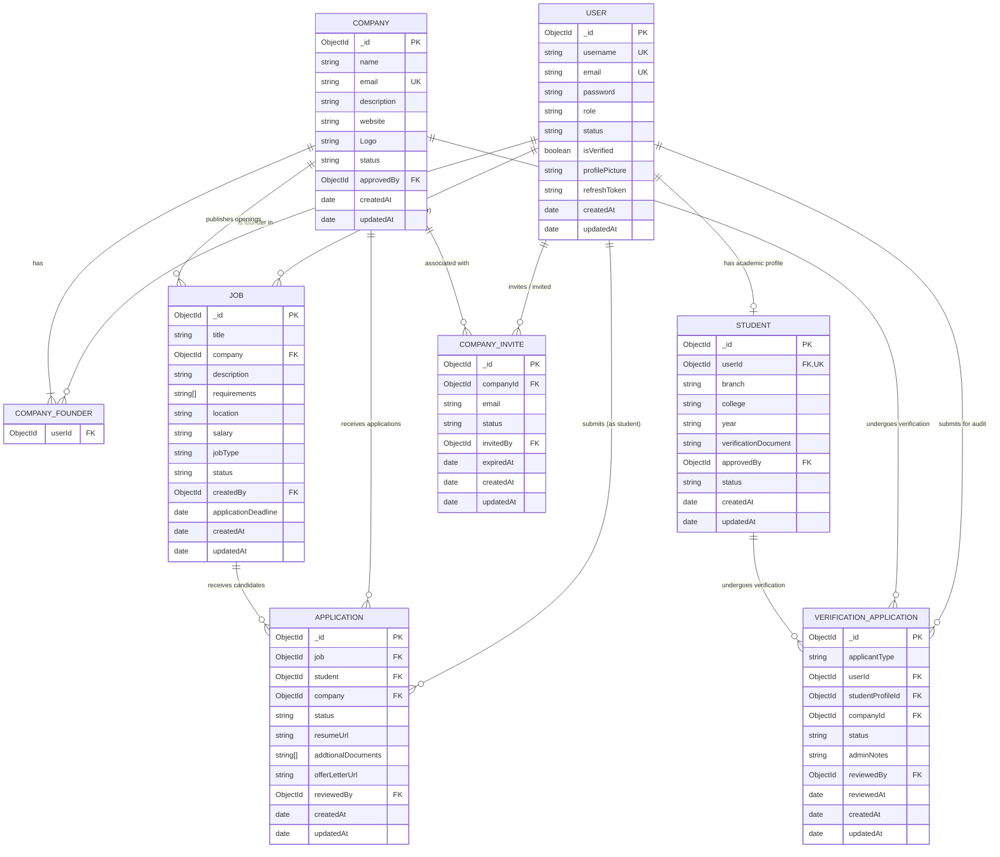

# DATABASE ARCHITECTURE & DATA LAYER SPECIFICATION

> **Repository**: `JobPostingBackend`  
> **Author**: Principal Database Architect, Backend Systems Analyst, Data Security Engineer & Repository Forensics Agent  
> **Status**: Comprehensive Production Reference (`VERIFIED`)  
> **Target Audience**: Backend Engineers, Frontend Engineers, DevOps/SRE, Security Auditors  
> **Source of Truth**: Mongoose Schemas, Repositories, Domain Entities/Policies, Use Cases, Presentation Controllers, Redis Infrastructure, Zod Schemas, Configuration & Tests.

---

## TABLE OF CONTENTS

1. [Executive Summary](#1-executive-summary)
2. [Evidence Methodology & Classification Standards](#2-evidence-methodology--classification-standards)
3. [Database & Persistence Store Inventory](#3-database--persistence-store-inventory)
4. [MongoDB Collection & Mongoose Model Inventory](#4-mongodb-collection--mongoose-model-inventory)
5. [Complete Schema Dictionary](#5-complete-schema-dictionary)
   - 5.1 [Collection: `users` (`User`)](#51-collection-users-user)
   - 5.2 [Collection: `companies` (`Company`)](#52-collection-companies-company)
   - 5.3 [Collection: `jobs` (`Job`)](#53-collection-jobs-job)
   - 5.4 [Collection: `applications` (`Application`)](#54-collection-applications-application)
   - 5.5 [Collection: `students` (`Student`)](#55-collection-students-student)
   - 5.6 [Collection: `verificationapplications` (`VerificationApplication`)](#56-collection-verificationapplications-verificationapplication)
   - 5.7 [Collection: `companyinvites` (`CompanyInvite`)](#57-collection-companyinvites-companyinvite)
   - 5.8 [Decommissioned / Inactive Models](#58-decommissioned--inactive-models)
6. [Nested Schema Details & Embedded Document Analysis](#6-nested-schema-details--embedded-document-analysis)
7. [Enum & State Dictionary + Lifecycle Transitions](#7-enum--state-dictionary--lifecycle-transitions)
8. [Entity Relationship Diagram (ERD)](#8-entity-relationship-diagram-erd)
9. [Detailed Relationship & Cardinality Matrix](#9-detailed-relationship--cardinality-matrix)
10. [Repository / Database Access Map](#10-repository--database-access-map)
11. [Use Case → Database Execution Map](#11-use-case--database-execution-map)
12. [API Endpoint → Database Matrix](#12-api-endpoint--database-matrix)
13. [Request → DTO → Domain → Persistence Flow](#13-request--dto--domain--persistence-flow)
14. [Client-Controlled vs Server-Controlled vs Derived Fields](#14-client-controlled-vs-server-controlled-vs-derived-fields)
15. [Mass Assignment Analysis & Defense Mechanisms](#15-mass-assignment-analysis--defense-mechanisms)
16. [Index Inventory & Performance Analysis](#16-index-inventory--performance-analysis)
17. [Query Pattern Analysis](#17-query-pattern-analysis)
18. [Pagination Architecture & Standards](#18-pagination-architecture--standards)
19. [Entity Lifecycle Analysis](#19-entity-lifecycle-analysis)
20. [Cascade & Referential Integrity Analysis](#20-cascade--referential-integrity-analysis)
21. [Transaction & Atomicity Analysis](#21-transaction--atomicity-analysis)
22. [Redis Data Model & Key Catalog](#22-redis-data-model--key-catalog)
23. [Cache-Aside Architecture & Invalidation Flows](#23-cache-aside-architecture--invalidation-flows)
24. [Idempotency Architecture & Execution Engine](#24-idempotency-architecture--execution-engine)
25. [OTP Security Data Model & Lifecycle](#25-otp-security-data-model--lifecycle)
26. [Email Verification End-to-End Data Flow](#26-email-verification-end-to-end-data-flow)
27. [File Storage & Media Metadata Model](#27-file-storage--media-metadata-model)
28. [Response DTO & Data Projection Analysis](#28-response-dto--data-projection-analysis)
29. [Frontend Data Contract (TypeScript Definitions)](#29-frontend-data-contract-typescript-definitions)
30. [Complete CRUD Matrix](#30-complete-crud-matrix)
31. [Endpoint → Entity Matrix](#31-endpoint--entity-matrix)
32. [Data Consistency Audit & Risk Assessment](#32-data-consistency-audit--risk-assessment)
33. [Database Performance Observations](#33-database-performance-observations)
34. [Backup, Recovery & Operational Forensics](#34-backup-recovery--operational-forensics)
35. [Database Environment Separation & Isolation](#35-database-environment-separation--isolation)
36. [Migration & Schema Versioning Findings](#36-migration--schema-versioning-findings)
37. [Security & Data Exposure Classification](#37-security--data-exposure-classification)
38. [Data Model Gaps & Unknowns](#38-data-model-gaps--unknowns)
39. [Final Database Architecture Summary](#39-final-database-architecture-summary)
40. [Evidence & Source Index](#40-evidence--source-index)

---

## 1. EXECUTIVE SUMMARY

The `JobPostingBackend` application is an enterprise-grade recruitment platform designed around a **Modular Monolith Architecture** adhering to Domain-Driven Design (DDD) and Clean Architecture principles. 

Persistence is divided across three distinct operational storage layers:
1. **Primary Persistence Tier**: MongoDB Atlas document database (`JobPosting` database), accessed via Mongoose ODM (v9.1.2) with 7 active domain collections (`users`, `companies`, `jobs`, `applications`, `students`, `verificationapplications`, `companyinvites`).
2. **Ephemeral & High-Velocity Infrastructure Tier**: Redis (v7.0-alpine via `ioredis` v6.0.0) providing distributed fixed-window rate limiting, cryptographic SHA-256 hashed OTP state management, cache-aside read acceleration for high-traffic read models, and distributed idempotency locking for transactional mutations.
3. **Binary Asset & Document Storage**: Cloudinary media storage (v2.8.0) storing profile avatars, company logos, student academic proof documents, candidate resumes, and offer letters, mediated through an ephemeral local filesystem staging buffer (`./public`).

The data model features a hybrid reference-embedding architecture. Authorization is strictly enforced at use-case domain policy boundaries before database queries execute, preventing Insecure Direct Object References (IDOR) and mass assignment vulnerabilities.

---

## 2. EVIDENCE METHODOLOGY & CLASSIFICATION STANDARDS

Every architectural fact, schema property, query shape, and data flow documented in this specification is derived strictly from direct static code analysis, configuration files, schema validators, and test execution traces within this repository.

### Evidence Hierarchy & Source Weighting
1. **Runtime Mongoose Schemas / Models**: `src/models/*.models.js`
2. **Infrastructure Repositories**: `src/modules/*/infrastructure/repositories/*.js`, `src/infrastructure/database/repositories/base.repository.js`
3. **Domain Entities & Policies**: `src/modules/*/domain/policies/*.js`, `src/modules/*/domain/ports/*.js`
4. **Application Use Cases**: `src/modules/*/application/use-cases/*.js`
5. **Presentation Controllers & Routers**: `src/modules/*/presentation/*`, `src/routes/*.js`, `src/controllers/*.js`
6. **Input Validation Schemas**: `src/schemas/*.js`, `src/modules/*/schemas/*.js`
7. **Infrastructure Services**: `src/infrastructure/redis/*`, `src/infrastructure/cache/*`, `src/infrastructure/otp/*`, `src/infrastructure/idempotency/*`, `src/infrastructure/storage/*`
8. **Configuration & Environment**: `src/config/env.js`, `src/constants.js`, `docker-compose.yml`, `.env.example`
9. **Automated Unit & Integration Test Suites**: `tests/unit/*.js`, `tests/api/*.js`

### Classification Taxonomy
- `VERIFIED`: Directly evidenced by active Mongoose schemas, running code, Zod schemas, or integration test suites.
- `INFERRED`: Strongly supported by architectural design, naming conventions, or configuration defaults, but not strictly bound at database level.
- `UNKNOWN`: Information not present or determinable within the local repository boundary (e.g. production cluster sizing, cloud backup schedules).
- `CONFLICTING`: Places where two distinct sources in code or documentation disagree (e.g. schema field typo vs repository projection, or default TTL vs controller expiration).

---

## 3. DATABASE & PERSISTENCE STORE INVENTORY

| Store | Technology | Purpose | Persistent? | Configuration Source | Status |
| :--- | :--- | :--- | :--- | :--- | :--- |
| **MongoDB Database** | MongoDB Atlas / Community (v6.0+) via Mongoose v9.1.2 | Primary document database storing all persistent business records across 7 collections. | **Yes** (Durable storage on disk) | `src/db/index.js`, `src/constants.js` (`DB_NAME="JobPosting"`), `src/config/env.js` (`MONGODB_URL`) | `VERIFIED` |
| **Redis Infrastructure** | Redis v7.0-alpine via `ioredis` v6.0.0 | Ephemeral caching, distributed rate limiting, hashed OTP management, and idempotency locking. | **Ephemeral** (Optional RDB/AOF volume `redis-data:/data` in Docker) | `src/config/env.js`, `src/infrastructure/redis/redis.client.js`, `docker-compose.yml` | `VERIFIED` |
| **Cloudinary Media Store** | Cloudinary v2.8.0 Cloud SDK | External object storage for user avatars, student ID verification cards, company logos, and PDF resumes. | **Yes** (Cloud Managed Storage) | `src/config/env.js`, `src/utils/cloudinary.js`, `src/infrastructure/storage/storage.port.js` | `VERIFIED` |
| **Nodemailer SMTP** | SMTP Gateway via `nodemailer` v9.0.5 | Stateless transactional email transport for delivering OTP verification codes. | **No** (Stateless transport; fallback to mock logger) | `src/config/env.js`, `src/infrastructure/email/email.port.js` | `VERIFIED` |
| **Local Upload Buffer** | Node.js File System (`./public`) via Multer v2.0.2 | Temporary disk buffer for multipart form uploads before streaming to Cloudinary and unlinking. | **No** (Ephemeral disk; unlinked immediately) | `src/middlewares/multer.middleware.js`, `src/utils/cloudinary.js` | `VERIFIED` |

---

## 4. MONGODB COLLECTION & MONGOOSE MODEL INVENTORY

| Model Name | MongoDB Collection Name | Primary Purpose | Repository Class | Domain Policy / Port | Timestamps | Pagination Plugin | Status |
| :--- | :--- | :--- | :--- | :--- | :--- | :--- | :--- |
| `User` | `users` | Core user identity, authentication credentials, RBAC roles, and status. | `MongoIdentityRepository`, `MongoUserRepository`, `MongoAdminRepository`, `MongoModerationRepository` | `AuthPolicy`, `UserPolicy`, `AdminPolicy`, `ModerationPolicy`, `IIdentityRepository`, `IUserRepository` | `{ timestamps: true }` (`createdAt`, `updatedAt`) | No | `VERIFIED` |
| `Company` | `companies` | Corporate profiles, branding, website, status, and multi-founder membership list. | `MongoCompanyRepository`, `MongoModerationRepository` | `CompanyPolicy`, `ICompanyRepository`, `IModerationRepository` | `{ timestamps: true }` (`createdAt`, `updatedAt`) | `mongoose-aggregate-paginate-v2` | `VERIFIED` |
| `Job` | `jobs` | Recruitment job openings, compensation, deadlines, requirements, and statuses. | `MongoJobRepository`, `MongoModerationRepository` | `JobPolicy`, `IJobRepository`, `IModerationRepository` | `{ timestamps: true }` (`createdAt`, `updatedAt`) | `mongoose-aggregate-paginate-v2` | `VERIFIED` |
| `Application` | `applications` | Job applications submitted by students, tracking status, resumes, and offer letters. | `MongoApplicationRepository`, `MongoModerationRepository` | `ApplicationPolicy`, `IApplicationRepository`, `IModerationRepository` | `{ timestamps: true }` (`createdAt`, `updatedAt`) | `mongoose-aggregate-paginate-v2` | `VERIFIED` |
| `Student` | `students` | Student academic profile, college, branch, enrollment year, and verification proof. | Direct Controller (`student.contoller.js`), `MongoStudentVerificationRepository` | `StudentVerificationPolicy` | `{ timestamps: true }` (`createdAt`, `updatedAt`) | `mongoose-aggregate-paginate-v2` | `VERIFIED` |
| `VerificationApplication` | `verificationapplications` | Formal verification workflows submitted by students or companies for admin audit. | `MongoStudentVerificationRepository` | `StudentVerificationPolicy`, `IStudentVerificationRepository` | `{ timestamps: true }` (`createdAt`, `updatedAt`) | `mongoose-aggregate-paginate-v2` | `VERIFIED` |
| `CompanyInvite` | `companyinvites` | Invitations sent to users by existing company founders to join company ownership. | Direct Controller (`companyinvite.controller.js`) | Inlined in controller | `{ timestamps: true }` (`createdAt`, `updatedAt`) | No | `VERIFIED` |
| `Block` | `blocks` (commented) | Deprecated model file (`src/models/block.models.js`). Block state is stored directly on `User.status` and `Company.status`. | None | None | None | None | `DECOMMISSIONED` |
| `Notification` | `notifications` (commented) | Deprecated / placeholder model file (`src/models/notification.models.js`). | None | None | None | None | `DECOMMISSIONED` |

---

## 5. COMPLETE SCHEMA DICTIONARY

Every active MongoDB collection and every declared schema property is extracted below with exact types, defaults, constraints, validation, and security sensitivity.

### 5.1 Collection: `users` (`User`)
- **Schema File**: `src/models/user.models.js`
- **Mongoose Model**: `mongoose.model("User", userSchema)`
- **Hooks**: `userSchema.pre("save")` — Hashes password with `bcrypt.hash(password, 10)` if modified.
- **Methods**: `isPasswordCorrect(password)`, `generateRefreshToken()`, `generateAccessToken()`

| Field | BSON Type | Required | Default | Nullable | Enum | Unique | Indexed | Immutable | Sensitive | Description | Source |
| :--- | :--- | :---: | :--- | :---: | :--- | :---: | :---: | :---: | :--- | :--- | :--- |
| `_id` | `ObjectId` | **Yes** (Gen) | `ObjectId()` | No | None | **Yes** | **Yes** (PK) | **Yes** | No | Primary user record identifier | `src/models/user.models.js` |
| `name` | `String` | **Yes** | None | No | None | No | No | No | No | Full name of the user (trimmed, lowercased) | `src/models/user.models.js:6-11` |
| `username` | `String` | **Yes** | None | No | None | **Yes** | **Yes** | No | No | Unique account username / handle (trimmed, lowercased) | `src/models/user.models.js:12-18` |
| `email` | `String` | **Yes** | None | No | None | **Yes** | **Yes** | No | No | Unique email address for authentication (trimmed, lowercased) | `src/models/user.models.js:19-25` |
| `password` | `String` | **Yes** | None | No | None | No | No | No | **SECRET** | Bcrypt hashed password string (cost factor 10). Never returned via API. | `src/models/user.models.js:26-30` |
| `role` | `String` | No | `"STUDENT"` | No | `["STUDENT", "COMPANY", "ADMIN"]` | No | No | Server | No | Role-based authorization role. Promoted via Admin or Invite Accept. | `src/models/user.models.js:31-35` |
| `profilePicture` | `String` | No | Default Avatar | **Yes** | None | No | No | No | No | Cloudinary public CDN URL of profile photo | `src/models/user.models.js:36-38` |
| `status` | `String` | No | `"PENDING"` | No | `["ACTIVE", "PENDING", "BLOCKED"]` | No | No | Server | No | Account status. `PENDING` until email verified; `BLOCKED` disables login. | `src/models/user.models.js:39-43` |
| `isVerified` | `Boolean` | No | `false` | No | None | No | No | Server | No | Flag indicating email address has been verified via OTP | `src/models/user.models.js:44-47` |
| `refreshToken` | `String` | No | None | **Yes** | None | No | No | Server | **SECRET** | Stored JWT refresh token for rotation and session invalidation | `src/models/user.models.js:48-50` |
| `createdAt` | `Date` | **Yes** (Gen) | `Date.now` | No | None | No | No | **Yes** | No | UTC timestamp when document was inserted | `src/models/user.models.js:51` |
| `updatedAt` | `Date` | **Yes** (Gen) | `Date.now` | No | None | No | No | No | No | UTC timestamp of last document update | `src/models/user.models.js:51` |

---

### 5.2 Collection: `companies` (`Company`)
- **Schema File**: `src/models/company.models.js`
- **Mongoose Model**: `mongoose.model("Company", companySchema)`
- **Plugins**: `mongooseAggregatePaginate`

| Field | BSON Type | Required | Default | Nullable | Enum | Unique | Indexed | Immutable | Sensitive | Description | Source |
| :--- | :--- | :---: | :--- | :---: | :--- | :---: | :---: | :---: | :--- | :--- | :--- |
| `_id` | `ObjectId` | **Yes** (Gen) | `ObjectId()` | No | None | **Yes** | **Yes** (PK) | **Yes** | No | Primary company record identifier | `src/models/company.models.js` |
| `name` | `String` | **Yes** | None | No | None | No | No | No | No | Legal registered company name | `src/models/company.models.js:5-8` |
| `email` | `String` | **Yes** | None | No | None | **Yes** | **Yes** | No | No | Corporate contact email address | `src/models/company.models.js:9-13` |
| `description` | `String` | **Yes** | None | No | None | No | No | No | No | Company overview and business details | `src/models/company.models.js:14-17` |
| `website` | `String` | No | None | **Yes** | None | No | No | No | No | Official corporate website URL | `src/models/company.models.js:18` |
| `Logo` | `String` | No | None | **Yes** | None | No | No | No | No | Cloudinary public CDN URL for company branding logo | `src/models/company.models.js:19` |
| `status` | `String` | No | `"PENDING"` | No | `["ACTIVE", "PENDING", "BLOCKED"]` | No | **Yes** | Server | No | Verification status (`ACTIVE`, `PENDING`, `BLOCKED`) | `src/models/company.models.js:20-24,39` |
| `founders` | `Array<Object>` | No | `[]` | No | None | No | **Yes** | Server | No | Array of subdocuments containing authorized founder User IDs | `src/models/company.models.js:25-31,38` |
| `founders.$.userId` | `ObjectId` (Ref `User`) | **Yes** | None | No | None | No | **Yes** | No | No | Foreign reference to `User` who holds founder privileges | `src/models/company.models.js:26-30` |
| `approvedBy` | `ObjectId` (Ref `User`) | No | None | **Yes** | None | No | No | Server | No | Foreign reference to `User` (Admin) who approved/blocked company | `src/models/company.models.js:32-35` |
| `createdAt` | `Date` | **Yes** (Gen) | `Date.now` | No | None | No | No | **Yes** | No | UTC timestamp of registration | `src/models/company.models.js:36` |
| `updatedAt` | `Date` | **Yes** (Gen) | `Date.now` | No | None | No | No | No | No | UTC timestamp of last update | `src/models/company.models.js:36` |

---

### 5.3 Collection: `jobs` (`Job`)
- **Schema File**: `src/models/job.models.js`
- **Mongoose Model**: `mongoose.model("Job", jobSchema)`
- **Plugins**: `mongooseAggregatePaginate`

| Field | BSON Type | Required | Default | Nullable | Enum | Unique | Indexed | Immutable | Sensitive | Description | Source |
| :--- | :--- | :---: | :--- | :---: | :--- | :---: | :---: | :---: | :--- | :--- | :--- |
| `_id` | `ObjectId` | **Yes** (Gen) | `ObjectId()` | No | None | **Yes** | **Yes** (PK) | **Yes** | No | Primary job posting identifier | `src/models/job.models.js` |
| `title` | `String` | **Yes** | None | No | None | No | No | No | No | Job opening title (e.g. "Backend Engineer") | `src/models/job.models.js:5-9` |
| `company` | `ObjectId` (Ref `Company`) | **Yes** | None | No | None | No | **Yes** | **Yes** | No | Foreign reference to `Company` offering the role | `src/models/job.models.js:10-14,42` |
| `description` | `String` | **Yes** | None | No | None | No | No | No | No | Detailed role description, responsibilities, requirements | `src/models/job.models.js:15-18` |
| `requirements` | `Array<String>` | **Yes** | None | No | None | No | No | No | No | List of required skills and qualifications | `src/models/job.models.js:19` |
| `location` | `String` | **Yes** | None | No | None | No | No | No | No | Location string (e.g. "Remote", "Bangalore, India") | `src/models/job.models.js:20` |
| `salary` | `String` | **Yes** | None | No | None | No | No | No | No | Salary / Compensation description string | `src/models/job.models.js:21` |
| `jobType` | `String` | **Yes** | None | No | `["FULLTIME", "INTERNSHIP"]` | No | **Yes** | No | No | Employment type category | `src/models/job.models.js:22-26,44` |
| `status` | `String` | No | `"ACTIVE"` | No | `["ACTIVE", "INACTIVE"]` | No | **Yes** | Server | No | Job listing status (`ACTIVE` or `INACTIVE`/Closed) | `src/models/job.models.js:27-31,42,44` |
| `createdBy` | `ObjectId` (Ref `User`) | **Yes** | None | No | None | No | **Yes** | **Yes** | No | Foreign reference to `User` who created the posting | `src/models/job.models.js:32-36,43` |
| `applicationDeadline` | `Date` | No | None | **Yes** | None | No | **Yes** | No | No | Expiration cutoff date for candidate applications | `src/models/job.models.js:37-39,45` |
| `createdAt` | `Date` | **Yes** (Gen) | `Date.now` | No | None | No | No | **Yes** | No | UTC timestamp of job creation | `src/models/job.models.js:40` |
| `updatedAt` | `Date` | **Yes** (Gen) | `Date.now` | No | None | No | No | No | No | UTC timestamp of last job update | `src/models/job.models.js:40` |

---

### 5.4 Collection: `applications` (`Application`)
- **Schema File**: `src/models/application.models.js`
- **Mongoose Model**: `mongoose.model("Application", applicationSchema)`
- **Plugins**: `mongooseAggregatePaginate`

| Field | BSON Type | Required | Default | Nullable | Enum | Unique | Indexed | Immutable | Sensitive | Description | Source |
| :--- | :--- | :---: | :--- | :---: | :--- | :---: | :---: | :---: | :--- | :--- | :--- |
| `_id` | `ObjectId` | **Yes** (Gen) | `ObjectId()` | No | None | **Yes** | **Yes** (PK) | **Yes** | No | Primary application record identifier | `src/models/application.models.js` |
| `job` | `ObjectId` (Ref `Job`) | **Yes** | None | No | None | Composite | **Yes** | **Yes** | No | Foreign reference to `Job` applied for | `src/models/application.models.js:5-9,40` |
| `student` | `ObjectId` (Ref `User`) | **Yes** | None | No | None | Composite | **Yes** | **Yes** | No | Foreign reference to applicant `User` | `src/models/application.models.js:10-14,40,41` |
| `company` | `ObjectId` (Ref `Company`) | **Yes** | None | No | None | No | **Yes** | **Yes** | No | Foreign reference to hiring `Company` | `src/models/application.models.js:15-19,42` |
| `status` | `String` | No | `"APPLIED"` | No | `["APPLIED", "SHORTLISTED", "OFFER", "REJECTED"]` | No | **Yes** | Server | No | Review status lifecycle state | `src/models/application.models.js:20-24,41,42` |
| `resumeUrl` | `String` | No | None | **Yes** | None | No | No | No | No | Cloudinary CDN URL of candidate resume document | `src/models/application.models.js:25-27` |
| `addtionalDocuments` | `Array<String>` | No | `[]` | No | None | No | No | No | No | Array of Cloudinary URLs for supplementary files | `src/models/application.models.js:28-30` |
| `offerLetterUrl` | `String` | No | None | **Yes** | None | No | No | Server | No | Cloudinary URL of generated/uploaded job offer letter | `src/models/application.models.js:31-33` |
| `reviewedBy` | `ObjectId` (Ref `User`) | No | None | **Yes** | None | No | No | Server | No | Foreign reference to `User` who reviewed application | `src/models/application.models.js:34-37` |
| `createdAt` | `Date` | **Yes** (Gen) | `Date.now` | No | None | No | No | **Yes** | No | UTC submission timestamp | `src/models/application.models.js:38` |
| `updatedAt` | `Date` | **Yes** (Gen) | `Date.now` | No | None | No | No | No | No | UTC review / status update timestamp | `src/models/application.models.js:38` |

> [!WARNING]
> **Field Typo Conflict Identified (`CONFLICTING`)**:  
> In `src/models/application.models.js:28`, the Mongoose schema property is spelled `addtionalDocuments` (missing the 'i'). In `src/modules/applications/infrastructure/repositories/MongoApplicationRepository.js:86,141` and `src/modules/applications/schemas/application.schemas.js:6`, the DTO/Aggregation pipelines reference `additionalDocuments`.

---

### 5.5 Collection: `students` (`Student`)
- **Schema File**: `src/models/student.models.js`
- **Mongoose Model**: `mongoose.model("Student", studentSchema)`
- **Plugins**: `mongooseAggregatePaginate`

| Field | BSON Type | Required | Default | Nullable | Enum | Unique | Indexed | Immutable | Sensitive | Description | Source |
| :--- | :--- | :---: | :--- | :---: | :--- | :---: | :---: | :---: | :--- | :--- | :--- |
| `_id` | `ObjectId` | **Yes** (Gen) | `ObjectId()` | No | None | **Yes** | **Yes** (PK) | **Yes** | No | Primary student profile record identifier | `src/models/student.models.js` |
| `userId` | `ObjectId` (Ref `User`) | **Yes** | None | No | None | **Yes** | **Yes** | **Yes** | No | Foreign reference to owning `User` (Strict 1:1) | `src/models/student.models.js:5-9,38` |
| `branch` | `String` | **Yes** | None | No | None | No | No | No | No | Academic engineering discipline / major | `src/models/student.models.js:10-13` |
| `college` | `String` | **Yes** | None | No | None | No | No | No | No | University / College institution name | `src/models/student.models.js:14-17` |
| `year` | `String` | **Yes** | None | No | None | No | No | No | No | Current academic year / batch string | `src/models/student.models.js:18-21` |
| `verificationDocument` | `String` | **Yes** | None | No | None | No | No | No | **SENSITIVE** | Cloudinary URL of college ID card or proof document | `src/models/student.models.js:22-25` |
| `approvedBy` | `ObjectId` (Ref `User`) | No | None | **Yes** | None | No | No | Server | No | Foreign reference to Admin `User` who verified student | `src/models/student.models.js:26-29` |
| `status` | `String` | No | `"PENDING"` | No | `["PENDING", "VERIFIED", "REJECTED", "BLOCKED"]` | No | **Yes** | Server | No | Academic verification state | `src/models/student.models.js:30-34,39` |
| `createdAt` | `Date` | **Yes** (Gen) | `Date.now` | No | None | No | No | **Yes** | No | UTC timestamp profile created | `src/models/student.models.js:36` |
| `updatedAt` | `Date` | **Yes** (Gen) | `Date.now` | No | None | No | No | No | No | UTC timestamp profile updated | `src/models/student.models.js:36` |

---

### 5.6 Collection: `verificationapplications` (`VerificationApplication`)
- **Schema File**: `src/models/verificationApplication.models.js`
- **Mongoose Model**: `mongoose.model("VerificationApplication", verificationApplicationSchema)`
- **Plugins**: `mongooseAggregatePaginate`

| Field | BSON Type | Required | Default | Nullable | Enum | Unique | Indexed | Immutable | Sensitive | Description | Source |
| :--- | :--- | :---: | :--- | :---: | :--- | :---: | :---: | :---: | :--- | :--- | :--- |
| `_id` | `ObjectId` | **Yes** (Gen) | `ObjectId()` | No | None | **Yes** | **Yes** (PK) | **Yes** | No | Primary verification request identifier | `src/models/verificationApplication.models.js` |
| `applicantType` | `String` | **Yes** | None | No | `["STUDENT", "COMPANY"]` | No | **Yes** | **Yes** | No | Applicant entity type being submitted for audit | `src/models/verificationApplication.models.js:6-10,49` |
| `userId` | `ObjectId` (Ref `User`) | **Yes** | None | No | None | No | **Yes** | **Yes** | No | Foreign reference to submitting `User` | `src/models/verificationApplication.models.js:12-16,50` |
| `studentProfileId` | `ObjectId` (Ref `Student`) | No | None | **Yes** | None | No | No | **Yes** | No | Foreign reference to `Student` profile (if applicantType=STUDENT) | `src/models/verificationApplication.models.js:18-21` |
| `companyId` | `ObjectId` (Ref `Company`) | No | None | **Yes** | None | No | No | **Yes** | No | Foreign reference to `Company` profile (if applicantType=COMPANY) | `src/models/verificationApplication.models.js:23-26` |
| `status` | `String` | No | `"PENDING"` | No | `["PENDING", "APPROVED", "REJECTED"]` | No | **Yes** | Server | No | Administrative review workflow state | `src/models/verificationApplication.models.js:28-32,49` |
| `adminNotes` | `String` | No | None | **Yes** | None | No | No | Server | No | Reviewer feedback or rejection reason text | `src/models/verificationApplication.models.js:34-36` |
| `reviewedBy` | `ObjectId` (Ref `User`) | No | None | **Yes** | None | No | No | Server | No | Foreign reference to Admin `User` who reviewed request | `src/models/verificationApplication.models.js:38-41` |
| `reviewedAt` | `Date` | No | None | **Yes** | None | No | No | Server | No | UTC timestamp of review completion | `src/models/verificationApplication.models.js:43-45` |
| `createdAt` | `Date` | **Yes** (Gen) | `Date.now` | No | None | No | No | **Yes** | No | UTC timestamp submitted | `src/models/verificationApplication.models.js:46` |
| `updatedAt` | `Date` | **Yes** (Gen) | `Date.now` | No | None | No | No | No | No | UTC timestamp last updated | `src/models/verificationApplication.models.js:46` |

---

### 5.7 Collection: `companyinvites` (`CompanyInvite`)
- **Schema File**: `src/models/companyinvite.models.js`
- **Mongoose Model**: `mongoose.model("CompanyInvite", companyInviteSchema)`

| Field | BSON Type | Required | Default | Nullable | Enum | Unique | Indexed | Immutable | Sensitive | Description | Source |
| :--- | :--- | :---: | :--- | :---: | :--- | :---: | :---: | :---: | :--- | :--- | :--- |
| `_id` | `ObjectId` | **Yes** (Gen) | `ObjectId()` | No | None | **Yes** | **Yes** (PK) | **Yes** | No | Primary invitation identifier | `src/models/companyinvite.models.js` |
| `companyId` | `ObjectId` (Ref `Company`) | **Yes** | None | No | None | No | No | **Yes** | No | Foreign reference to `Company` target of invitation | `src/models/companyinvite.models.js:4-8` |
| `email` | `String` | **Yes** | None | No | None | No | No | **Yes** | No | Invitee email address | `src/models/companyinvite.models.js:9-12` |
| `status` | `String` | No | `"PENDING"` | No | `["PENDING", "ACCEPTED", "REJECTED"]` | No | No | Server | No | Invitation lifecycle state | `src/models/companyinvite.models.js:13-17` |
| `invitedBy` | `ObjectId` (Ref `User`) | **Yes** | None | No | None | No | No | **Yes** | No | Foreign reference to founder `User` who sent the invite | `src/models/companyinvite.models.js:18-22` |
| `expiredAt` | `Date` | **Yes** | Schema: +15m / Controller: +7d | No | None | No | No | **Yes** | No | UTC expiration timestamp | `src/models/companyinvite.models.js:23-27`, `src/controllers/companyinvite.controller.js:75-76` |
| `createdAt` | `Date` | **Yes** (Gen) | `Date.now` | No | None | No | No | **Yes** | No | UTC dispatch timestamp | `src/models/companyinvite.models.js:28` |
| `updatedAt` | `Date` | **Yes** (Gen) | `Date.now` | No | None | No | No | No | No | UTC status change timestamp | `src/models/companyinvite.models.js:28` |

> [!WARNING]
> **TTL Default Discrepancy (`CONFLICTING`)**:  
> In `src/models/companyinvite.models.js:26`, the schema default provides a 15-minute expiration (`Date.now() + 15 * 60 * 1000`). However, in runtime use case `src/controllers/companyinvite.controller.js:75-83`, the controller explicitly computes `expirationDate.setDate(expirationDate.getDate() + 7)` (7 days) and writes it upon creation.

---

### 5.8 Decommissioned / Inactive Models
1. **`Block` (`src/models/block.models.js`)**: Commented out legacy schema. Moderation status is maintained via `status: "BLOCKED"` on `User` and `Company`.
2. **`Notification` (`src/models/notification.models.js`)**: Commented out placeholder schema.

---

## 6. NESTED SCHEMA DETAILS & EMBEDDED DOCUMENT ANALYSIS

### Nested Document: `Company.founders`
In `src/models/company.models.js:25-31`:
```javascript
founders: [{
    userId: {
        type: mongoose.Schema.Types.ObjectId,
        ref: "User",
        required: true,
    },
}]
```
- **Embedding Strategy**: Embedded Array of Subdocuments.
- **Each Element Contains**:
  - `_id`: Auto-generated subdocument `ObjectId` (Mongoose default for array elements).
  - `userId`: `ObjectId` referencing `User` collection.
- **Index Support**: Indexed via compound multikey index `companySchema.index({ "founders.userId": 1 })`.
- **Update Mechanics**:
  - Initial creation: `founders: [{ userId }]` initialized with registration user.
  - Adding founder upon invite accept (`src/controllers/companyinvite.controller.js:133`):
    `$push: { founders: { userId: req.user._id } }`.
- **Query Aggregation**: In `MongoCompanyRepository.js:64-97`, populated using `$lookup` on `users` with an inner `$map` and `$filter` projection to omit sensitive password and refresh token fields.

---

## 7. ENUM & STATE DICTIONARY + LIFECYCLE TRANSITIONS

### Master Enum Catalog

| Entity | Enum Property | Permitted Values | Default Value | Business Definition | Code Source |
| :--- | :--- | :--- | :--- | :--- | :--- |
| `User` | `role` | `STUDENT`, `COMPANY`, `ADMIN` | `"STUDENT"` | Authorization tier. `ADMIN` has system-wide permissions. | `src/models/user.models.js:33` |
| `User` | `status` | `ACTIVE`, `PENDING`, `BLOCKED` | `"PENDING"` | `PENDING`: Unverified email; `ACTIVE`: Verified; `BLOCKED`: Login prevented. | `src/models/user.models.js:41` |
| `Company` | `status` | `ACTIVE`, `PENDING`, `BLOCKED` | `"PENDING"` | `PENDING`: Awaiting admin; `ACTIVE`: Verified; `BLOCKED`: Hidden from searches. | `src/models/company.models.js:22` |
| `Job` | `jobType` | `FULLTIME`, `INTERNSHIP` | None (Req) | Employment arrangement classification. | `src/models/job.models.js:24` |
| `Job` | `status` | `ACTIVE`, `INACTIVE` | `"ACTIVE"` | `ACTIVE`: Accepting applications; `INACTIVE`: Closed. | `src/models/job.models.js:29` |
| `Application`| `status` | `APPLIED`, `SHORTLISTED`, `OFFER`, `REJECTED` | `"APPLIED"` | Candidate application stage. | `src/models/application.models.js:22` |
| `Student` | `status` | `PENDING`, `VERIFIED`, `REJECTED`, `BLOCKED` | `"PENDING"` | Academic identity verification state. | `src/models/student.models.js:32` |
| `VerificationApplication` | `applicantType` | `STUDENT`, `COMPANY` | None (Req) | Discriminator for audit target type. | `src/models/verificationApplication.models.js:8` |
| `VerificationApplication` | `status` | `PENDING`, `APPROVED`, `REJECTED` | `"PENDING"` | Administrative review outcome. | `src/models/verificationApplication.models.js:30` |
| `CompanyInvite` | `status` | `PENDING`, `ACCEPTED`, `REJECTED` | `"PENDING"` | Founder invitation lifecycle state. | `src/models/companyinvite.models.js:15` |

---

### Verified State Transition Graph

#### 1. User State Transitions
```text
[REGISTER] ───> PENDING ───(VerifyEmail / OTP)───> ACTIVE ───(Admin BlockUser)───> BLOCKED
                  │                                   │                               │
                  │                                   └───(Admin BlockUser)───────────┤
                  │                                                                   │
                  └─────────────────────────(Admin UnblockUser) <─────────────────────┘
```
- **Transition: User Creation**
  - Current: None -> Next: `PENDING` | Actor: Anonymous | Route: `POST /api/v1/users/register` | Source: `src/modules/auth/application/use-cases/RegisterUserUseCase.js:35`
- **Transition: Email Verification**
  - Current: `PENDING` -> Next: `ACTIVE` (with `isVerified=true`) | Actor: User | Route: `POST /api/v1/auth/email-verification/verify` | Source: `src/modules/auth/infrastructure/repositories/MongoEmailVerificationRepository.js:23`
- **Transition: Admin Block User**
  - Current: `ACTIVE` / `PENDING` -> Next: `BLOCKED` | Actor: Admin | Route: `PATCH /api/v1/admin/users/:userId/block` | Source: `src/modules/admin/application/use-cases/BlockUserUseCase.js:27`
- **Transition: Admin Unblock User**
  - Current: `BLOCKED` -> Next: `ACTIVE` | Actor: Admin | Route: `PATCH /api/v1/admin/users/:userId/unblock` | Source: `src/modules/admin/application/use-cases/UnblockUserUseCase.js:13`

#### 2. Company State Transitions
```text
[REGISTER] ───> PENDING ───(Admin Approve Verification)───> ACTIVE ───(Admin BlockCompany)───> BLOCKED
                  │                                            │                                 │
                  └──────(Admin Reject Verification)───────────┴───(Admin UnblockCompany) <──────┘
```
- **Transition: Company Registration**
  - Current: None -> Next: `PENDING` | Actor: User (`COMPANY` role) | Route: `POST /api/v1/companies/register` | Source: `src/modules/companies/application/use-cases/CreateCompanyUseCase.js:28`
- **Transition: Verification Approval**
  - Current: `PENDING` -> Next: `ACTIVE` | Actor: Admin | Route: `PATCH /api/v1/verifications/:requestId/approve` | Source: `src/modules/verification/infrastructure/repositories/MongoStudentVerificationRepository.js:69-73`
- **Transition: Admin Moderation Block / Unblock**
  - Current: Any -> Next: `BLOCKED` / `ACTIVE` | Actor: Admin | Route: `PATCH /api/v1/admin/companies/:companyId/block` | Source: `src/modules/admin/application/use-cases/BlockCompanyUseCase.js:13`

#### 3. Job State Transitions
```text
[CREATE] ───> ACTIVE ───(CloseJob / Admin Modify)───> INACTIVE ───(Admin Modify)───> ACTIVE
```
- **Transition: Job Posting**
  - Current: None -> Next: `ACTIVE` | Actor: Company Founder | Route: `POST /api/v1/jobs/create` | Source: `src/modules/jobs/application/use-cases/CreateJobUseCase.js:36`
- **Transition: Job Closure**
  - Current: `ACTIVE` -> Next: `INACTIVE` | Actor: Company Founder | Route: `PATCH /api/v1/jobs/:jobId/close` | Source: `src/modules/jobs/application/use-cases/CloseJobUseCase.js:25`

#### 4. Job Application State Transitions
```text
[SUBMIT] ───> APPLIED ───(ReviewApplication)───> SHORTLISTED ───(ReviewApplication)───> OFFER
                 │                                    │
                 └──────(ReviewApplication)───────────┴───(ReviewApplication)────────> REJECTED
```
- **Transition: Application Submission**
  - Current: None -> Next: `APPLIED` | Actor: Student User | Route: `POST /api/v1/applications/submit` | Source: `src/modules/applications/application/use-cases/SubmitApplicationUseCase.js:66`
- **Transition: Review Progression**
  - Current: `APPLIED` / `SHORTLISTED` -> Next: `SHORTLISTED` | `OFFER` | `REJECTED` | Actor: Company Founder / Admin | Route: `PATCH /api/v1/applications/:applicationId/review` | Source: `src/modules/applications/application/use-cases/ReviewApplicationUseCase.js:34-45`

#### 5. Company Invite State Transitions
```text
[SEND] ───> PENDING ───(AcceptFounderInvite)───> ACCEPTED (User promoted to COMPANY role)
              │
              ├───(RejectFounderInvite / Expired)───> REJECTED
              └───(CancelFounderInvite)─────────────> [DELETED]
```
- **Transition: Invite Dispatch**: Current: None -> Next: `PENDING` (7-day expiry) | Source: `src/controllers/companyinvite.controller.js:82`
- **Transition: Invite Acceptance**: Current: `PENDING` -> Next: `ACCEPTED` (Adds User to `Company.founders` and updates `User.role="COMPANY"`) | Source: `src/controllers/companyinvite.controller.js:130-146`

---

## 8. ENTITY RELATIONSHIP DIAGRAM (ERD)



---

## 9. DETAILED RELATIONSHIP & CARDINALITY MATRIX

| From Entity | Field | To Entity | Cardinality | Mechanism | Ownership | Delete Behavior | Enforcement Source |
| :--- | :--- | :--- | :---: | :--- | :--- | :--- | :--- |
| `Company` | `founders.userId` | `User` | **M:N** | Embedded subdocument array of ObjectIds (`founders: [{ userId }]`) | Shared | Retained (No automatic cascade) | `src/models/company.models.js:26` |
| `Company` | `approvedBy` | `User` | **N:1** | Foreign ObjectId Reference | Reference | Retained | `src/models/company.models.js:33` |
| `Job` | `company` | `Company` | **N:1** | Foreign ObjectId Reference | Parent (`Company`) | Orphaned on hard company delete; Filtered on `BLOCKED` | `src/models/job.models.js:11` |
| `Job` | `createdBy` | `User` | **N:1** | Foreign ObjectId Reference | Parent (`User`) | Retained | `src/models/job.models.js:33` |
| `Application` | `job` | `Job` | **N:1** | Foreign ObjectId Reference | Parent (`Job`) | Orphaned if Job hard-deleted | `src/models/application.models.js:6` |
| `Application` | `student` | `User` | **N:1** | Foreign ObjectId Reference | Submitter (`User`) | Retained; Filtered if User `BLOCKED` | `src/models/application.models.js:11` |
| `Application` | `company` | `Company` | **N:1** | Foreign ObjectId Reference | Denormalized parent | Retained; Filtered if Company `BLOCKED` | `src/models/application.models.js:16` |
| `Application` | `reviewedBy` | `User` | **N:1** | Foreign ObjectId Reference | Reviewer (`User`) | Nullable | `src/models/application.models.js:35` |
| `Student` | `userId` | `User` | **1:1** | Foreign ObjectId Reference with Unique Index | Owner (`User`) | Retained | `src/models/student.models.js:6,38` |
| `Student` | `approvedBy` | `User` | **N:1** | Foreign ObjectId Reference | Admin (`User`) | Nullable | `src/models/student.models.js:27` |
| `VerificationApplication` | `userId` | `User` | **N:1** | Foreign ObjectId Reference | Submitter (`User`) | Retained | `src/models/verificationApplication.models.js:13` |
| `VerificationApplication` | `studentProfileId`| `Student` | **N:1** | Foreign ObjectId Reference | Subject Profile | Retained | `src/models/verificationApplication.models.js:19` |
| `VerificationApplication` | `companyId` | `Company` | **N:1** | Foreign ObjectId Reference | Subject Company | Retained | `src/models/verificationApplication.models.js:24` |
| `VerificationApplication` | `reviewedBy` | `User` | **N:1** | Foreign ObjectId Reference | Admin (`User`) | Nullable | `src/models/verificationApplication.models.js:39` |
| `CompanyInvite` | `companyId` | `Company` | **N:1** | Foreign ObjectId Reference | Target Company | Retained (Must be manually canceled) | `src/models/companyinvite.models.js:5` |
| `CompanyInvite` | `invitedBy` | `User` | **N:1** | Foreign ObjectId Reference | Inviting Founder | Retained | `src/models/companyinvite.models.js:19` |

---

## 10. REPOSITORY / DATABASE ACCESS MAP

| Repository Class | Method Name | Target Collection | Operation | Filter / Query Shape | Projections / Populates | Fields Written |
| :--- | :--- | :--- | :--- | :--- | :--- | :--- |
| `MongoIdentityRepository` | `findByEmail` | `users` | `findOne` | `{ email }` | Default (All fields) | None |
| `MongoIdentityRepository` | `findByUsername` | `users` | `findOne` | `{ username }` | Default (All fields) | None |
| `MongoIdentityRepository` | `findByEmailOrUsername`| `users` | `findOne` | `{ $or: [{ email }, { username }] }` | Default (All fields) | None |
| `MongoIdentityRepository` | `updateRefreshToken` | `users` | `findByIdAndUpdate` | `userId` | `{ new: true }` | `$set: { refreshToken }` |
| `MongoIdentityRepository` | `updatePassword` | `users` | `findById` + `save()`| `userId` | None | `password` (Triggers bcrypt pre-save) |
| `MongoUserRepository` | `findById` | `users` | `findById` | `id` | `.select("-password -refreshToken")` | None |
| `MongoUserRepository` | `updateAccountDetails` | `users` | `findByIdAndUpdate` | `id` | `.select("-password -refreshToken")` | `$set: { name?, email?, username? }` |
| `MongoUserRepository` | `updateProfilePhoto` | `users` | `findByIdAndUpdate` | `id` | `.select("-password -refreshToken")` | `$set: { profilePicture }` |
| `MongoCompanyRepository` | `findById` | `companies` | `findById` | `id` | `.populate("founders.userId", "name email username profilePicture")`<br>`.populate("approvedBy", "name email")` | None |
| `MongoCompanyRepository` | `findByEmail` | `companies` | `findOne` | `{ email }` | Default | None |
| `MongoCompanyRepository` | `create` | `companies` | `create` | None | None | `{ name, email, description, website?, Logo?, founders, status: "PENDING" }` |
| `MongoCompanyRepository` | `update` | `companies` | `findByIdAndUpdate` | `id` | Calls `findById(id)` | `$set: { name?, email?, description?, website?, Logo? }` |
| `MongoCompanyRepository` | `delete` | `companies` | `findByIdAndDelete` | `id` | None | Document deleted |
| `MongoCompanyRepository` | `findAll` | `companies` | `aggregatePaginate` | Match: `{ status: { $ne: "BLOCKED" }, founders.userId? }` | Populates `founders.userId` (stripping secret fields) | None |
| `MongoJobRepository` | `findById` | `jobs` | `findById` | `id` | Populates `company.founders.userId` and `createdBy` | None |
| `MongoJobRepository` | `create` | `jobs` | `create` | None | Calls `findById(newJob._id)` | `{ title, company, description, requirements, location, salary, jobType, createdBy, applicationDeadline?, status: "ACTIVE" }` |
| `MongoJobRepository` | `update` | `jobs` | `findByIdAndUpdate` | `id` | Calls `findById(id)` | `$set: sanitizedFields` |
| `MongoJobRepository` | `delete` | `jobs` | `findByIdAndDelete` | `id` | None | Document deleted |
| `MongoJobRepository` | `findAll` | `jobs` | `aggregatePaginate` | Match: status, type, deadline, unblocked company/creator | `$lookup: companies`, `$lookup: users` | None |
| `MongoApplicationRepository`| `findById` | `applications` | `findById` | `id` | Populates `job.company`, `company`, `student`, `reviewedBy` | None |
| `MongoApplicationRepository`| `findByJobAndStudent` | `applications` | `findOne` | `{ job, student }` | Default | None |
| `MongoApplicationRepository`| `create` | `applications` | `create` | None | Calls `findById(newApp._id)` | `{ job, student, company, resumeUrl?, additionalDocuments, status: "APPLIED" }` |
| `MongoApplicationRepository`| `update` | `applications` | `findByIdAndUpdate` | `id` | Calls `findById(id)` | `$set: { status?, reviewedBy?, offerLetterUrl? }` |
| `MongoApplicationRepository`| `delete` | `applications` | `findByIdAndDelete` | `id` | None | Document deleted |
| `MongoStudentVerificationRepository`| `findById` | `verificationapplications` | `findById` | `id` | Populates `userId`, `studentProfileId`, `companyId`, `reviewedBy` | None |
| `MongoStudentVerificationRepository`| `create` | `verificationapplications` | `create` | None | Calls `findById(created._id)` | `{ applicantType, userId, studentProfileId?, companyId?, status: "PENDING" }` |
| `MongoStudentVerificationRepository`| `updateStatus` | `verificationapplications` + `students` / `companies` | Multi-write (Sequential) | `id` | Populates related models | `$set: { status, adminNotes, reviewedBy, reviewedAt }` on request + updates `Student` or `Company` status |
| `MongoAdminRepository` | `createAdmin` | `users` | `create` | None | Calls `findById(created._id)` | `{ name, username, email, password, role: "ADMIN", status: "ACTIVE" }` |
| `MongoAdminRepository` | `updateRole` | `users` | `findByIdAndUpdate` | `userId` | `.select("-password -refreshToken")` | `$set: { role }` |
| `MongoModerationRepository` | `updateUserStatus` | `users` | `findByIdAndUpdate` | `userId` | `.select("-password -refreshToken")` | `$set: { status }` |
| `MongoModerationRepository` | `updateCompanyStatus`| `companies` | `findByIdAndUpdate` | `companyId` | Populates `founders.userId` | `$set: { status, approvedBy }` |
| `MongoModerationRepository` | `updateJob` | `jobs` | `findByIdAndUpdate` | `jobId` | Populates `company`, `createdBy` | `$set: updateFields` |
| `MongoModerationRepository` | `deleteJob` | `jobs` | `findByIdAndDelete` | `jobId` | None | Document deleted |
| `MongoModerationRepository` | `deleteApplication`| `applications` | `findByIdAndDelete` | `applicationId`| None | Document deleted |

---

## 11. USE CASE → DATABASE EXECUTION MAP

```text
========================================================================================================
USE CASE                      REPOSITORY                     MODEL(S)               COLLECTION(S)   OPERATION
========================================================================================================
RegisterUserUseCase           MongoIdentityRepository        User                   users           create
LoginUserUseCase              MongoIdentityRepository        User                   users           findOne, update
LogoutUserUseCase             MongoIdentityRepository        User                   users           update (refreshToken)
RefreshTokenUseCase           MongoIdentityRepository        User                   users           findById, update
ChangePasswordUseCase         MongoIdentityRepository        User                   users           findById, save
RequestEmailVerification      MongoEmailVerificationRepo     User                   users (Redis)   Redis SET (OTP)
VerifyEmailUseCase            MongoEmailVerificationRepo     User                   users           findByIdAndUpdate
GetCurrentUserUseCase         MongoUserRepository            User                   users           findById
UpdateAccountDetailsUseCase   MongoUserRepository            User                   users           findByIdAndUpdate
UpdateProfilePhotoUseCase     MongoUserRepository            User                   users           findByIdAndUpdate
CreateCompanyUseCase          MongoCompanyRepository         Company                companies       create
UpdateCompanyUseCase          MongoCompanyRepository         Company                companies       findByIdAndUpdate
DeleteCompanyUseCase          MongoCompanyRepository         Company                companies       findByIdAndDelete
GetCompanyUseCase             MongoCompanyRepository         Company                companies       findById (Redis Cache)
ListCompaniesUseCase          MongoCompanyRepository         Company                companies       aggregatePaginate
ListMyCompaniesUseCase        MongoCompanyRepository         Company                companies       aggregatePaginate
CreateJobUseCase              MongoJobRepository             Job                    jobs            create
UpdateJobUseCase              MongoJobRepository             Job                    jobs            findByIdAndUpdate
CloseJobUseCase               MongoJobRepository             Job                    jobs            findByIdAndUpdate
DeleteJobUseCase              MongoJobRepository             Job                    jobs            findByIdAndDelete
GetJobUseCase                 MongoJobRepository             Job                    jobs            findById (Redis Cache)
ListJobsUseCase               MongoJobRepository             Job                    jobs            aggregatePaginate
SubmitApplicationUseCase      MongoApplicationRepository     Application, Job       applications    create (Idempotent)
WithdrawApplicationUseCase    MongoApplicationRepository     Application            applications    findByIdAndDelete
GetApplicationUseCase         MongoApplicationRepository     Application            applications    findById
ListStudentApplications       MongoApplicationRepository     Application            applications    aggregatePaginate
ListCompanyApplications       MongoApplicationRepository     Application, Job       applications    aggregatePaginate
ReviewApplicationUseCase      MongoApplicationRepository     Application            applications    findByIdAndUpdate
SubmitStudentVerification     MongoStudentVerificationRepo   VerificationApp        verificationapps create
GetStudentVerificationStatus  MongoStudentVerificationRepo   VerificationApp        verificationapps findOne
ListPendingVerifications      MongoStudentVerificationRepo   VerificationApp        verificationapps find + count
ReviewStudentVerification     MongoStudentVerificationRepo   VerificationApp,       verificationapps,findByIdAndUpdate +
                                                             Student, Company       students, comps findByIdAndUpdate
CreateAdminUseCase            MongoAdminRepository           User                   users           create
RemoveAdminUseCase            MongoAdminRepository           User                   users           findByIdAndUpdate
BlockUserUseCase              MongoModerationRepository      User                   users           findByIdAndUpdate
UnblockUserUseCase            MongoModerationRepository      User                   users           findByIdAndUpdate
BlockCompanyUseCase           MongoModerationRepository      Company                companies       findByIdAndUpdate
UnblockCompanyUseCase         MongoModerationRepository      Company                companies       findByIdAndUpdate
ListUsersForModeration        MongoModerationRepository      User                   users           find + count
ListApplicationsAdmin         MongoModerationRepository      Application            applications    aggregatePaginate
DeleteApplicationAdmin        MongoModerationRepository      Application            applications    findByIdAndDelete
ListJobsAdmin                 MongoModerationRepository      Job                    jobs            aggregatePaginate
ModifyJobAdmin                MongoModerationRepository      Job                    jobs            findByIdAndUpdate
DeleteJobAdmin                MongoModerationRepository      Job                    jobs            findByIdAndDelete
SendFounderInvite (Ctrl)      Direct Mongoose                CompanyInvite, Company companyinvites  create
AcceptFounderInvite (Ctrl)    Direct Mongoose                CompanyInvite, Company,companyinvites, findByIdAndUpdate
                                                             User                   companies,users
RejectFounderInvite (Ctrl)    Direct Mongoose                CompanyInvite          companyinvites  findByIdAndUpdate
CancelFounderInvite (Ctrl)    Direct Mongoose                CompanyInvite          companyinvites  findByIdAndDelete
CreateStudentProfile (Ctrl)   Direct Mongoose                Student                students        create
UpdateStudentDetails (Ctrl)   Direct Mongoose                Student                students        findByIdAndUpdate
========================================================================================================
```

---

## 12. API ENDPOINT → DATABASE MATRIX

| HTTP Method | Route Endpoint | Authentication | Required Role | Collections Read | Collections Written | Redis Keys Read / Written | Request Payload Fields | Response Payload |
| :--- | :--- | :--- | :--- | :--- | :--- | :--- | :--- | :--- |
| `POST` | `/api/v1/users/register` | None (Public) | None | `users` | `users` | `ratelimit:register:*` | `name`, `email`, `username`, `password`, `role?`, `companyId?`, `profileImage?` | `User` (omitting secret fields) |
| `POST` | `/api/v1/users/login` | None (Public) | None | `users` | `users` | `ratelimit:login:*` | `email`, `password` | `{ user, accessToken, refreshToken }` |
| `POST` | `/api/v1/users/refresh-token`| None (Public) | None | `users` | `users` | `ratelimit:refreshToken:*` | `refreshToken` (in body or cookie) | `{ accessToken, refreshToken }` |
| `POST` | `/api/v1/users/logout` | `verifyJWT` | Any | `users` | `users` | None | None | `{}` (Cookies cleared) |
| `POST` | `/api/v1/users/change-password`| `verifyJWT` | Any | `users` | `users` | None | `oldPassword`, `newPassword` | `{}` |
| `GET` | `/api/v1/users/current-user` | `verifyJWT` | Any | `users` | None | None | None | `User` object (from `req.user`) |
| `PATCH`| `/api/v1/users/update-account` | `verifyJWT` | Any | `users` | `users` | None | `name?`, `email?`, `username?` | Updated `User` object |
| `PATCH`| `/api/v1/users/update-profile-photo` | `verifyJWT` | Any | `users` | `users` | None | `profileImage` (multipart file) | Updated `User` object |
| `POST` | `/api/v1/auth/otp/request` | None (Public) | None | None | None | `ratelimit:otpRequest:*`, `otp:email_verify:*`, `otp:cooldown:*` | `email`, `purpose?` | `{ message }` |
| `POST` | `/api/v1/auth/otp/verify` | None (Public) | None | None | None | `ratelimit:otpVerify:*`, `otp:email_verify:*`, `otp:attempts:*`, `otp:lockout:*` | `email`, `otp`, `purpose?` | `{ success, message }` |
| `POST` | `/api/v1/auth/email-verification/request` | None (Public) | None | None | None | `ratelimit:otpRequest:*`, `otp:email_verification:*`, `otp:cooldown:*` | `email` | `{ message }` |
| `POST` | `/api/v1/auth/email-verification/verify` | None (Public) | None | `users` | `users` | `ratelimit:otpVerify:*`, `otp:email_verification:*`, `otp:attempts:*` | `email`, `otp` | `{ success, message }` |
| `GET` | `/api/v1/companies` | None (Public) | None | `companies`, `users` | None | None | Query: `page`, `limit`, `status`, `search`, `myCompanies` | Paginated `Company[]` with populated founders |
| `GET` | `/api/v1/companies/my` | `verifyJWT`, `checkNotBlocked` | Any | `companies`, `users` | None | None | Query: `page`, `limit` | Paginated `Company[]` owned by user |
| `GET` | `/api/v1/companies/:companyId`| None (Public) | None | `companies`, `users` | None | `cache:company:{companyId}` (GET/SET) | Param: `companyId` | Single `Company` document |
| `POST` | `/api/v1/companies/register` | `verifyJWT`, `checkNotBlocked`, `verifyRole("COMPANY")` | `COMPANY` | `companies` | `companies` | None | `name`, `email`, `description`, `website?`, `Logo?` | Created `Company` document |
| `PATCH`| `/api/v1/companies/:companyId/update` | `verifyJWT`, `checkNotBlocked` | Founder / Admin | `companies` | `companies` | `cache:company:{companyId}` (DEL) | `name?`, `email?`, `description?`, `website?`, `Logo?` | Updated `Company` document |
| `DELETE`| `/api/v1/companies/:companyId/withdraw` | `verifyJWT`, `checkNotBlocked` | Founder / Admin | `companies` | `companies` | `cache:company:{companyId}` (DEL) | Param: `companyId` | `{}` |
| `GET` | `/api/v1/jobs` | None (Public) | None | `jobs`, `companies`, `users` | None | None | Query: `page`, `limit`, `status`, `sortBy`, `jobType`, `search`, `includeExpired` | Paginated `Job[]` with company details |
| `GET` | `/api/v1/jobs/:jobId` | None (Public) | None | `jobs`, `companies`, `users` | None | `cache:job:{jobId}` (GET/SET) | Param: `jobId` | Single `Job` document |
| `POST` | `/api/v1/jobs/create` | `verifyJWT`, `checkNotBlocked`, `verifyRole("COMPANY")` | `COMPANY` | `jobs` | `jobs` | `cache:jobs:list:*` (DEL pattern) | `title`, `company`, `description`, `requirements`, `location`, `salary`, `jobType`, `applicationDeadline?` | Created `Job` document |
| `PATCH`| `/api/v1/jobs/:jobId/update` | `verifyJWT`, `checkNotBlocked` | Founder / Admin | `jobs`, `companies` | `jobs` | `cache:job:{jobId}` (DEL), `cache:jobs:list:*` (DEL) | `title?`, `description?`, `requirements?`, `location?`, `salary?`, `jobType?`, `applicationDeadline?` | Updated `Job` document |
| `PATCH`| `/api/v1/jobs/:jobId/close` | `verifyJWT`, `checkNotBlocked` | Founder / Admin | `jobs`, `companies` | `jobs` | `cache:job:{jobId}` (DEL), `cache:jobs:list:*` (DEL) | Param: `jobId` | Updated `Job` (`status="INACTIVE"`) |
| `DELETE`| `/api/v1/jobs/:jobId/delete` | `verifyJWT`, `checkNotBlocked` | Founder / Admin | `jobs`, `companies` | `jobs` | `cache:job:{jobId}` (DEL), `cache:jobs:list:*` (DEL) | Param: `jobId` | `{}` |
| `POST` | `/api/v1/applications/submit` | `verifyJWT`, `checkNotBlocked` | Student | `jobs`, `applications` | `applications` | `idempotency:application:submit:*` | `jobId`, `additionalDocuments?`, `resume` (file), Header `X-Idempotency-Key` | Created `Application` document |
| `GET` | `/api/v1/applications/my-applications`| `verifyJWT` | Student | `applications`, `jobs`, `companies` | None | None | Query: `page`, `limit`, `status` | Paginated `Application[]` |
| `GET` | `/api/v1/applications/job/:jobId` | `verifyJWT`, `checkNotBlocked`, `verifyRole("COMPANY")` | Founder / Admin | `jobs`, `applications`, `users` | None | None | Param: `jobId`, Query: `page`, `limit`, `status` | Paginated `Application[]` |
| `GET` | `/api/v1/applications/:applicationId/status` | `verifyJWT` | Owner Student | `applications`, `companies` | None | None | Param: `applicationId` | Single `Application` document |
| `PATCH`| `/api/v1/applications/:applicationId/review` | `verifyJWT`, `checkNotBlocked`, `verifyRole("COMPANY")` | Founder / Admin | `applications`, `jobs` | `applications` | None | Param: `applicationId`, Body: `status`, `offerLetterUrl?` | Updated `Application` document |
| `DELETE`| `/api/v1/applications/:applicationId` | `verifyJWT`, `checkNotBlocked` | Owner Student | `applications` | `applications` | None | Param: `applicationId` (Must be <= 24h old) | `{}` |
| `POST` | `/api/v1/students` | `verifyJWT`, `verifyRole("STUDENT")` | `STUDENT` | `students` | `students` | None | `branch`, `college`, `year`, `verificationDocument` (file) | Created `Student` profile |
| `GET` | `/api/v1/students/profile` | `verifyJWT`, `verifyRole("STUDENT")` | `STUDENT` | `students` | None | None | None | `Student` profile document |
| `PATCH`| `/api/v1/students/profile` | `verifyJWT`, `verifyRole("STUDENT")` | `STUDENT` | `students` | `students` | None | `branch?`, `college?`, `year?`, `verificationDocument?` (file) | Updated `Student` profile |
| `GET` | `/api/v1/students/pending` | `verifyJWT`, `verifyRole("ADMIN")` | `ADMIN` | `students`, `users` | None | None | None | List of pending `Student[]` |
| `PATCH`| `/api/v1/students/:studentId/verify` | `verifyJWT`, `verifyRole("ADMIN")` | `ADMIN` | `students` | `students` | None | Param: `studentId` | Verified `Student` document |
| `PATCH`| `/api/v1/students/:studentId/reject` | `verifyJWT`, `verifyRole("ADMIN")` | `ADMIN` | `students` | `students` | None | Param: `studentId` | Rejected `Student` document |
| `POST` | `/api/v1/verifications` | `verifyJWT` | Any | `verificationapplications` | `verificationapplications` | None | `applicantType`, `studentProfileId?`, `companyId?` | Created `VerificationApplication` |
| `GET` | `/api/v1/verifications/my-request` | `verifyJWT` | Any | `verificationapplications`, `users`, `students`, `companies` | None | None | None | User's `VerificationApplication` |
| `GET` | `/api/v1/verifications` | `verifyJWT`, `verifyRole("ADMIN")` | `ADMIN` | `verificationapplications`, `users`, `students`, `companies` | None | None | Query: `status`, `applicantType`, `page`, `limit` | Paginated `VerificationApplication[]` |
| `PATCH`| `/api/v1/verifications/:requestId/approve` | `verifyJWT`, `verifyRole("ADMIN")` | `ADMIN` | `verificationapplications`, `students`, `companies` | `verificationapplications`, `students`, `companies` | None | Param: `requestId`, Body: `adminNotes?` | Approved `VerificationApplication` |
| `PATCH`| `/api/v1/verifications/:requestId/reject` | `verifyJWT`, `verifyRole("ADMIN")` | `ADMIN` | `verificationapplications`, `students`, `companies` | `verificationapplications`, `students`, `companies` | None | Param: `requestId`, Body: `adminNotes?` | Rejected `VerificationApplication` |
| `POST` | `/api/v1/invites/send` | `verifyJWT`, `checkNotBlocked`, `verifyRole("COMPANY")` | Founder | `companies`, `users`, `companyinvites` | `companyinvites` | None | `companyId`, `email` | Created `CompanyInvite` |
| `POST` | `/api/v1/invites/:inviteId/accept` | `verifyJWT`, `checkNotBlocked` | Invitee User | `companyinvites`, `companies`, `users` | `companyinvites`, `companies`, `users` | None | Param: `inviteId` | Updated `Company` with new founder |
| `POST` | `/api/v1/invites/:inviteId/reject` | `verifyJWT`, `checkNotBlocked` | Invitee User | `companyinvites` | `companyinvites` | None | Param: `inviteId` | Updated `CompanyInvite` (`status="REJECTED"`) |
| `DELETE`| `/api/v1/invites/:inviteId/cancel` | `verifyJWT`, `checkNotBlocked` | Inviter / Founder / Admin | `companyinvites`, `companies` | `companyinvites` | None | Param: `inviteId` | `{}` |
| `GET` | `/api/v1/invites/my-invites` | `verifyJWT` | Any | `companyinvites`, `companies`, `users` | `companyinvites` (Expired auto-marked REJECTED) | None | Query: `status` | Array of `CompanyInvite[]` |
| `GET` | `/api/v1/invites/company/:companyId` | `verifyJWT`, `checkNotBlocked` | Founder / Admin | `companies`, `companyinvites`, `users` | None | None | Param: `companyId`, Query: `status` | Array of `CompanyInvite[]` |
| `POST` | `/api/v1/admin/create-admin` | `verifyJWT`, `verifyRole("ADMIN")` | `ADMIN` | `users` | `users` | None | `name`, `username`, `email`, `password` | Created Admin `User` document |
| `DELETE`| `/api/v1/admin/remove-admin/:userId` | `verifyJWT`, `verifyRole("ADMIN")` | `ADMIN` | `users` | `users` | None | Param: `userId` | Updated `User` (`role="STUDENT"`) |
| `GET` | `/api/v1/admin/users` | `verifyJWT`, `verifyRole("ADMIN")` | `ADMIN` | `users` | None | None | Query: `page`, `limit`, `role`, `status`, `search` | Paginated `User[]` |
| `PATCH`| `/api/v1/admin/users/:userId/block` | `verifyJWT`, `verifyRole("ADMIN")` | `ADMIN` | `users` | `users` | None | Param: `userId` | Updated `User` (`status="BLOCKED"`) |
| `PATCH`| `/api/v1/admin/users/:userId/unblock` | `verifyJWT`, `verifyRole("ADMIN")` | `ADMIN` | `users` | `users` | None | Param: `userId` | Updated `User` (`status="ACTIVE"`) |
| `PATCH`| `/api/v1/admin/companies/:companyId/block` | `verifyJWT`, `verifyRole("ADMIN")` | `ADMIN` | `companies` | `companies` | None | Param: `companyId` | Updated `Company` (`status="BLOCKED"`) |
| `PATCH`| `/api/v1/admin/companies/:companyId/unblock` | `verifyJWT`, `verifyRole("ADMIN")` | `ADMIN` | `companies` | `companies` | None | Param: `companyId` | Updated `Company` (`status="ACTIVE"`) |
| `GET` | `/api/v1/admin/applications` | `verifyJWT`, `verifyRole("ADMIN")` | `ADMIN` | `applications`, `jobs`, `companies`, `users` | None | None | Query: `page`, `limit`, `status`, `jobId`, `companyId` | Paginated `Application[]` |
| `DELETE`| `/api/v1/admin/applications/:applicationId` | `verifyJWT`, `verifyRole("ADMIN")` | `ADMIN` | `applications` | `applications` | None | Param: `applicationId` | `{}` |
| `GET` | `/api/v1/admin/jobs` | `verifyJWT`, `verifyRole("ADMIN")` | `ADMIN` | `jobs`, `companies`, `users` | None | None | Query: `page`, `limit`, `status`, `jobType`, `companyId` | Paginated `Job[]` |
| `PATCH`| `/api/v1/admin/jobs/:jobId` | `verifyJWT`, `verifyRole("ADMIN")` | `ADMIN` | `jobs` | `jobs` | None | Param: `jobId`, Body: updateFields | Updated `Job` document |
| `DELETE`| `/api/v1/admin/jobs/:jobId` | `verifyJWT`, `verifyRole("ADMIN")` | `ADMIN` | `jobs` | `jobs` | None | Param: `jobId` | `{}` |

---

## 13. REQUEST → DTO → DOMAIN → PERSISTENCE FLOW

```text
HTTP Request (JSON / Multipart)
      │
      ▼
Express Router & Multer Staging (diskStorage to ./public)
      │
      ▼
Zod Validation Middleware (`src/middlewares/validate.middleware.js`)
      │ (Filters invalid inputs, types, string lengths, enums)
      ▼
Presentation Controller DTO Extraction
      │ (Maps req.body, req.file, req.user._id, req.params)
      ▼
Domain Policy Sanitization & Authorization Guard (`UserPolicy`, `CompanyPolicy`, `JobPolicy`, `ApplicationPolicy`)
      │ (Enforces role permissions, ownership checks, whitelist attribute filtering)
      ▼
Application Use Case Interactor
      │ (Coordinates business rules, idempotency locks, media uploads, cache invalidation)
      ▼
Repository Port Implementation (`Mongo*Repository`)
      │ (Builds Mongoose queries, projections, aggregation stages, atomic updates)
      ▼
MongoDB Atlas Persistence Tier (`JobPosting` Database)
```

---

## 14. CLIENT-CONTROLLED VS SERVER-CONTROLLED VS DERIVED FIELDS

| Entity | Client-Controlled (Writable on Create/Update) | Server-Controlled (Protected / Set by Logic) | Derived / Generated (Computed at Runtime) | Stripped / Secret (Never Exposed via API) |
| :--- | :--- | :--- | :--- | :--- |
| **`User`** | `name`, `username`, `email`, `password`, `profileImage` (file) | `_id`, `role`, `status`, `isVerified`, `refreshToken`, `createdAt`, `updatedAt` | `_id`, `createdAt`, `updatedAt` | `password`, `refreshToken` |
| **`Company`** | `name`, `email`, `description`, `website`, `Logo` (file or string) | `_id`, `status`, `founders`, `approvedBy`, `createdAt`, `updatedAt` | `founders` populated user subdocuments | `founders.userId.password`, `founders.userId.refreshToken` |
| **`Job`** | `title`, `description`, `requirements`, `location`, `salary`, `jobType`, `applicationDeadline` | `_id`, `company`, `status`, `createdBy`, `createdAt`, `updatedAt` | Unwound `company`, `createdBy` objects | None |
| **`Application`**| `jobId`, `additionalDocuments`, `resume` (file) | `_id`, `job`, `student`, `company`, `status`, `offerLetterUrl`, `reviewedBy`, `createdAt`, `updatedAt` | Nested `job`, `company`, `student` summaries | None |
| **`Student`** | `branch`, `college`, `year`, `verificationDocument` (file) | `_id`, `userId`, `status`, `approvedBy`, `createdAt`, `updatedAt` | `userId` populated user details | None |
| **`VerificationApplication`** | `applicantType`, `studentProfileId`, `companyId` | `_id`, `userId`, `status`, `adminNotes`, `reviewedBy`, `reviewedAt`, `createdAt`, `updatedAt` | Populated `userId`, `studentProfileId`, `companyId` | None |
| **`CompanyInvite`**| `companyId`, `email` | `_id`, `status`, `invitedBy`, `expiredAt`, `createdAt`, `updatedAt` | Populated `companyId`, `invitedBy` | None |

---

## 15. MASS ASSIGNMENT ANALYSIS & DEFENSE MECHANISMS

Mass assignment (over-posting) attacks are mitigated across three distinct defense-in-depth architectural boundaries:

1. **Boundary 1: Zod Schema Whitelisting (`validate.middleware.js`)**  
   Every mutating endpoint passes through strict Zod schemas (e.g. `registerCompanySchema`, `updateJobSchema`, `updateAccountDetailsSchema`). Only declared fields are extracted into `req.body`; undeclared fields (like `role`, `status`, `_id`, `isVerified`, `approvedBy`) are ignored or rejected.

2. **Boundary 2: Domain Policy Sanitization Functions**  
   Domain policies provide explicit whitelist filtering before repository persistence:
   - `UserPolicy.sanitizeUpdateFields`: Whitelists strictly `['name', 'email', 'username']` (`src/modules/users/domain/policies/UserPolicy.js:7-16`).
   - `CompanyPolicy.sanitizeUpdateFields`: Whitelists strictly `['name', 'email', 'description', 'website', 'Logo']` (`src/modules/companies/domain/policies/CompanyPolicy.js:17-26`).
   - `JobPolicy.sanitizeUpdateFields`: Whitelists strictly `['title', 'description', 'requirements', 'location', 'salary', 'jobType', 'applicationDeadline']` (`src/modules/jobs/domain/policies/JobPolicy.js:17-26`).

3. **Boundary 3: Explicit DTO Destructuring in Controllers & Use Cases**  
   Use case interactors explicitly destructure allowed properties (e.g. `const { name, email, username } = req.body`) rather than forwarding the raw `req.body` object directly to Mongoose `create` or `findByIdAndUpdate`.

---

## 16. INDEX INVENTORY & PERFORMANCE ANALYSIS

### Active Declared Mongoose Indexes

| Collection | Index Name / Specification | Index Fields | Order | Unique | Sparse | Partial | TTL | Purpose | Source File |
| :--- | :--- | :--- | :---: | :---: | :---: | :---: | :---: | :--- | :--- |
| `users` | `_id_` (Default PK) | `_id` | 1 | **Yes** | No | No | No | Primary Key Lookup | Mongoose Default |
| `users` | `username_1` | `username` | 1 | **Yes** | No | No | No | Unique Handle Enforcement & Login Lookup | `src/models/user.models.js:15` |
| `users` | `email_1` | `email` | 1 | **Yes** | No | No | No | Unique Email & Auth Lookup | `src/models/user.models.js:22` |
| `companies` | `_id_` (Default PK) | `_id` | 1 | **Yes** | No | No | No | Primary Key Lookup | Mongoose Default |
| `companies` | `email_1` | `email` | 1 | **Yes** | No | No | No | Unique Corporate Email Constraint | `src/models/company.models.js:12` |
| `companies` | `founders.userId_1` | `founders.userId` | 1 | No | No | No | No | Founder Membership Lookup (`GetMyCompanies`) | `src/models/company.models.js:38` |
| `companies` | `status_1` | `status` | 1 | No | No | No | No | Moderation Status Filtering | `src/models/company.models.js:39` |
| `jobs` | `_id_` (Default PK) | `_id` | 1 | **Yes** | No | No | No | Primary Key Lookup | Mongoose Default |
| `jobs` | `company_1_status_1` | `company`, `status` | 1, 1 | No | No | No | No | Compound Company Job Listing Filter | `src/models/job.models.js:42` |
| `jobs` | `createdBy_1` | `createdBy` | 1 | No | No | No | No | Employer Job Listing Filter | `src/models/job.models.js:43` |
| `jobs` | `status_1_jobType_1` | `status`, `jobType` | 1, 1 | No | No | No | No | Public Job Search & Filter Acceleration | `src/models/job.models.js:44` |
| `jobs` | `applicationDeadline_1` | `applicationDeadline` | 1 | No | No | No | No | Expired Job Filtering (`applicationDeadline >= now`) | `src/models/job.models.js:45` |
| `applications` | `_id_` (Default PK) | `_id` | 1 | **Yes** | No | No | No | Primary Key Lookup | Mongoose Default |
| `applications` | `job_1_student_1` | `job`, `student` | 1, 1 | **Yes** | No | No | No | **Strict Duplicate Prevention (1 App Per Job Per Student)** | `src/models/application.models.js:40` |
| `applications` | `student_1_status_1` | `student`, `status` | 1, 1 | No | No | No | No | Student Application Dashboard Queries | `src/models/application.models.js:41` |
| `applications` | `company_1_status_1` | `company`, `status` | 1, 1 | No | No | No | No | Company Applicant Review Dashboard Queries | `src/models/application.models.js:42` |
| `students` | `_id_` (Default PK) | `_id` | 1 | **Yes** | No | No | No | Primary Key Lookup | Mongoose Default |
| `students` | `userId_1` | `userId` | 1 | **Yes** | No | No | No | **Strict 1:1 Student to User Mapping** | `src/models/student.models.js:38` |
| `students` | `status_1` | `status` | 1 | No | No | No | No | Admin Pending Student List Filtering | `src/models/student.models.js:39` |
| `verificationapplications` | `_id_` (Default PK) | `_id` | 1 | **Yes** | No | No | No | Primary Key Lookup | Mongoose Default |
| `verificationapplications` | `status_1_applicantType_1` | `status`, `applicantType` | 1, 1 | No | No | No | No | Admin Verification Queue Filtering | `src/models/verificationApplication.models.js:49` |
| `verificationapplications` | `userId_1` | `userId` | 1 | No | No | No | No | User Verification Status Lookup | `src/models/verificationApplication.models.js:50` |
| `companyinvites` | `_id_` (Default PK) | `_id` | 1 | **Yes** | No | No | No | Primary Key Lookup | Mongoose Default |

---

### Potential Missing Indexes (`POTENTIAL IMPROVEMENT`)
1. **`companyinvites` Compound Lookup Index**:
   - Proposed: `{ companyId: 1, email: 1, status: 1 }`
   - Purpose: Accelerates duplicate pending invite checks in `src/controllers/companyinvite.controller.js:64`.
2. **`companyinvites` Invitee Lookup Index**:
   - Proposed: `{ email: 1, status: 1 }`
   - Purpose: Accelerates `GetMyInvites` query (`src/controllers/companyinvite.controller.js:195`).
3. **`companyinvites` Expiration TTL Index**:
   - Proposed: `{ expiredAt: 1 }` with `expireAfterSeconds: 0`
   - Purpose: Automates MongoDB document cleanup for expired invitations.
4. **`jobs` Text Search Index**:
   - Proposed: `{ title: "text", description: "text" }`
   - Purpose: Replaces `$regex` case-insensitive table scans with MongoDB Text Search engine.

---

## 17. QUERY PATTERN ANALYSIS

1. **Equality Lookups**:
   - `User.findOne({ email })`, `User.findOne({ username })` -> Backed by unique B-Tree indexes.
   - `Student.findOne({ userId })` -> Backed by unique index `userId_1`.
   - `VerificationApplication.findOne({ userId, status: "PENDING" })` -> Backed by `userId_1`.

2. **Compound Filtering & Sorting**:
   - `Job.aggregate` matching `{ status: "ACTIVE", applicationDeadline: { $gte: now } }` with `$sort: { createdAt: -1 }` -> Backed by compound indexes.
   - `Application.aggregate` matching `{ student: userId, status }` -> Backed by `{ student: 1, status: 1 }`.

3. **Aggregation Pipelines & Join Patterns (`$lookup`)**:
   - `MongoJobRepository.findAll`: Performs `$lookup` against `companies` and `users` (author), applies post-join `$match` to prune records where `company.status === "BLOCKED"` or `createdBy.status === "BLOCKED"`.
   - `MongoCompanyRepository.findAll`: Performs `$lookup` against `users` on `founders.userId` and reshapes founder objects via `$map` and `$filter`.
   - `MongoApplicationRepository.findStudentApplications`: Performs `$lookup` on `jobs` and `companies` to provide embedded job summary in application lists.

4. **Regex Substring Search**:
   - `title: { $regex: search, $options: "i" }` in `MongoJobRepository.js:65` and `MongoCompanyRepository.js:56`.
   - *Index Note*: Regex searches with leading wildcards cannot utilize standard B-Tree index prefix matching and execute collection scans unless supported by full-text indexes (`POTENTIAL IMPROVEMENT`).

---

## 18. PAGINATION ARCHITECTURE & STANDARDS

All list endpoints implement paginated responses conforming to standard pagination contracts:

### Aggregation-Based Pagination (`mongoose-aggregate-paginate-v2`)
Used across `MongoCompanyRepository`, `MongoJobRepository`, `MongoApplicationRepository`, and `MongoModerationRepository`.

- **Parameters Accepted**:
  - `page`: 1-based page index (Default: `1`)
  - `limit`: Page window size (Default: `10`, Admin default: `20`, Max capped by Zod: `100`)
- **Pagination Response Format**:
```json
{
  "docs": [ ... ],
  "totalDocs": 45,
  "limit": 10,
  "page": 1,
  "totalPages": 5,
  "pagingCounter": 1,
  "hasPrevPage": false,
  "hasNextPage": true,
  "prevPage": null,
  "nextPage": 2
}
```

### Manual Skip/Limit Pagination
Used in `MongoStudentVerificationRepository.findRequests` and `MongoModerationRepository.findUsers`:
```javascript
const skip = (parseInt(page) - 1) * parseInt(limit);
const results = await Model.find(query).skip(skip).limit(limit).sort({ createdAt: -1 });
const total = await Model.countDocuments(query);
```

---

## 19. ENTITY LIFECYCLE ANALYSIS

```text
========================================================================================================
ENTITY          CREATION                    ACTIVE WORKFLOW             MODERATION / DELETION
========================================================================================================
User            Register -> PENDING         Email OTP -> ACTIVE         Admin Block -> BLOCKED
                                            Profile / Password updates  (Cannot block self or admin)
--------------------------------------------------------------------------------------------------------
Company         Register -> PENDING         Admin Approve -> ACTIVE     Admin Block -> BLOCKED
                                            Update details / Logo       Withdraw -> Hard Delete
--------------------------------------------------------------------------------------------------------
Job             Create -> ACTIVE            Update details              Close -> status="INACTIVE"
                                            Receive applications        Delete -> Hard Delete
--------------------------------------------------------------------------------------------------------
Application     Submit (Idempotent)         SHORTLISTED -> OFFER        Student Withdraw (<=24h)
                -> APPLIED                  -> REJECTED                 Admin Delete -> Hard Delete
--------------------------------------------------------------------------------------------------------
Student Profile Create -> PENDING           Admin Verify -> VERIFIED    Admin Reject -> REJECTED
                                            Update docs -> PENDING      Admin Block -> BLOCKED
--------------------------------------------------------------------------------------------------------
Verification    Submit -> PENDING           Admin Audit Queue           Approve / Reject
Application                                                             (Updates underlying profile)
--------------------------------------------------------------------------------------------------------
Company Invite  Send -> PENDING             Accept -> ACCEPTED          Reject -> REJECTED
                (+7 days expiration)        (Promotes user to COMPANY)  Cancel -> Hard Delete
========================================================================================================
```

---

## 20. CASCADE & REFERENTIAL INTEGRITY ANALYSIS

MongoDB does not enforce Foreign Key referential integrity or cascading deletions at the database engine level. The application manages cascades at the application layer:

1. **Company Deletion (`DeleteCompanyUseCase`)**:
   - `Company.findByIdAndDelete(companyId)` executes a hard delete.
   - *Cascade Behavior*: Related `Job` and `Application` documents are **NOT** automatically cascade-deleted in the database. However, in all public listing aggregation pipelines (`MongoJobRepository.js:141`, `MongoApplicationRepository.js:79`), an inner join check filters out orphaned records (`company.status: { $ne: "BLOCKED" }`).
2. **Job Deletion (`DeleteJobUseCase` / `DeleteJobAdminUseCase`)**:
   - `Job.findByIdAndDelete(jobId)` deletes the job document. Applications referencing `jobId` remain in the database unless cleaned up manually.
3. **Application Withdrawal (`WithdrawApplicationUseCase`)**:
   - Students can only delete their application within **24 hours** of submission (`ApplicationPolicy.canWithdraw`). After 24 hours, deletion is forbidden.
4. **User Blocking (`BlockUserUseCase`)**:
   - Soft state update: `status = "BLOCKED"`.
   - Middleware `checkNotBlocked` prevents blocked users from performing any authenticated mutations, creating jobs, submitting applications, or accepting invites. Aggregation pipelines automatically filter out jobs created by blocked users.

---

## 21. TRANSACTION & ATOMICITY ANALYSIS

### Single-Document Atomicity (`VERIFIED`)
All single-document write operations (`findByIdAndUpdate`, `create`, `findByIdAndDelete`, `save`) are atomic at the MongoDB storage engine level (WiredTiger).

### Multi-Document Sequential Updates (`VERIFIED`)
Multi-collection operations are executed sequentially in application code without active MongoDB replica set sessions (`startSession`):
1. `AcceptFounderInvite` (`src/controllers/companyinvite.controller.js:130-146`):
   - Step 1: `Company.findByIdAndUpdate` pushes founder to `founders`.
   - Step 2: `User.findByIdAndUpdate` updates `role = "COMPANY"`.
   - Step 3: `CompanyInvite.findByIdAndUpdate` sets `status = "ACCEPTED"`.
2. `ReviewStudentVerificationUseCase` (`MongoStudentVerificationRepository.js:48-75`):
   - Step 1: `VerificationApplication.findByIdAndUpdate` sets review status and admin notes.
   - Step 2: `Student.findByIdAndUpdate` or `Company.findByIdAndUpdate` updates underlying profile status to `VERIFIED` / `ACTIVE`.

> [!NOTE]
> **Transaction Assessment (`VERIFIED FACT`)**:  
> Multi-document workflows execute as sequential atomic single-document updates. In the event of an infrastructure crash between Step 1 and Step 2, partial state could persist. MongoDB replica set transactions (`startSession()`) are not initialized in active code.

---

## 22. REDIS DATA MODEL & KEY CATALOG

All Redis keys use a deterministic namespace structure with the application prefix `bc_api:` (`config.redis.keyPrefix`).

| Key Pattern | Data Type | Purpose | TTL | Created By | Read By | Invalidation / Cleanup | Security Tier |
| :--- | :--- | :--- | :---: | :--- | :--- | :--- | :--- |
| `bc_api:otp:{purpose}:{hashed_id}` | JSON String (`{ hash, createdAt }`) | Stores SHA-256 hashed 6-digit OTP code | **600s** (10m) | `otpService.storeOtp` | `otpService.verifyOtp` | Deleted upon successful verification or 5 failed attempts | **CRITICAL (Hashed)** |
| `bc_api:otp:attempts:{purpose}:{hashed_id}` | Integer Counter | Tracks failed OTP verification attempts | **600s** (10m) | `otpService.verifyOtp` | `otpService.verifyOtp` | Incremented on mismatch; deleted on success | **HIGH** |
| `bc_api:otp:cooldown:{purpose}:{hashed_id}` | String (`"1"`) | Enforces 60-second rate limit between OTP requests | **60s** (1m) | `otpService.storeOtp` | `otpService.checkCooldown` | Automatic TTL expiration | **MEDIUM** |
| `bc_api:otp:lockout:{purpose}:{hashed_id}` | String (`"1"`) | Locks account for 15 minutes after 5 failed attempts | **900s** (15m) | `otpService.verifyOtp` | `otpService.checkLockout` | Automatic TTL expiration | **HIGH** |
| `bc_api:ratelimit:{tier}:{identity}:{windowId}`| Integer Counter | Distributed Fixed-Window API rate limiter counter | **60s** (1m) | `fixedWindowRateLimiter` | `fixedWindowRateLimiter` | Automatic window expiration | **MEDIUM** |
| `bc_api:cache:job:{jobId}` | JSON String (Serialized `Job`) | Read-through cache for single job details | **300s** (5m) | `GetJobUseCase` | `GetJobUseCase` | Deleted on `UpdateJob`, `CloseJob`, `DeleteJob` | **PUBLIC** |
| `bc_api:cache:jobs:list:{queryHash}` | JSON String (Serialized `Job[]`) | Read-through cache for job listing searches | **120s** (2m) | Cache strategy spec | Cache strategy spec | Deleted via pattern scan `cache:jobs:list:*` | **PUBLIC** |
| `bc_api:cache:company:{companyId}` | JSON String (Serialized `Company`) | Read-through cache for company details | **300s** (5m) | `GetCompanyUseCase` | `GetCompanyUseCase` | Deleted on `UpdateCompany`, `WithdrawCompany` | **PUBLIC** |
| `bc_api:idempotency:{scope}:{key}` | JSON String (`{ status, response, timestamp }`) | Prevents duplicate job application submissions | **60s** (Lock) / **86400s** (Result) | `idempotencyService` | `idempotencyService` | Released on failure; TTL expiration on completion | **HIGH** |

---

## 23. CACHE-ASIDE ARCHITECTURE & INVALIDATION FLOWS

### Cache-Aside Read Flow
```text
Client Request ───> GetJobUseCase / GetCompanyUseCase
                         │
                         ▼
                   Redis GET (`cache:job:{id}`)
                         │
        ┌────────────────┴────────────────┐
        ▼                                 ▼
   [Cache HIT]                       [Cache MISS]
  Return JSON parsed                      │
  cached object                           ▼
                                    Query MongoDB
                                          │
                                          ▼
                                    Redis SETEX (TTL 300s)
                                          │
                                          ▼
                                    Return fresh document
```

### Invalidation Triggers & Rules
1. **Job Details (`cache:job:{jobId}`)**:
   - Invalidated immediately via `cacheService.delete` upon `UpdateJobPosting`, `CloseJobPosting`, and `DeleteJobPosting`.
2. **Job Search Lists (`cache:jobs:list:*`)**:
   - Invalidated via pattern deletion (`cacheService.deleteByPattern("cache:jobs:list:*")`) on `CreateJobPosting`, `UpdateJobPosting`, `CloseJobPosting`, and `DeleteJobPosting`.
3. **Company Details (`cache:company:{companyId}`)**:
   - Invalidated immediately via `cacheService.delete` upon `UpdateCompanyDetails` and `WithdrawCompany`.

### Fail-Open Resilience
If Redis is down or encounters network timeout during cache reads or writes, `cacheService` catches the exception, logs a warning via Pino, and **fails open to MongoDB Atlas** without interrupting user requests.

---

## 24. IDEMPOTENCY ARCHITECTURE & EXECUTION ENGINE

Implemented via `src/infrastructure/idempotency/idempotency.service.js` to eliminate double-submission race conditions (e.g. rapid double-clicking on application submission).

### Execution Lifecycle
```text
1. Client submits POST /api/v1/applications/submit with Header `X-Idempotency-Key`
2. Key format: `idempotency:application:submit:{userId}:{jobId}`
3. Atomic Reservation via Redis `SETNX`:
   - Payload: `{"status": "PROCESSING", "timestamp": 1724123456789}` with 60-second lock TTL.
4. If SETNX fails (Lock already held):
   - Returns HTTP 409 Conflict ("Application submission is currently processing").
5. Business Logic executes (File upload -> MongoDB application creation).
6. Success:
   - Result payload saved with 24-hour TTL (`86400s`): `{"status": "COMPLETED", "response": createdApp}`.
7. Error / Exception:
   - Lock released immediately via Redis `DEL` to allow retry.
```

---

## 25. OTP SECURITY DATA MODEL & LIFECYCLE

Implemented via `src/infrastructure/otp/otp.service.js`:

1. **Generation**: Cryptographically uniform 6-digit random integer using `crypto.randomInt(100000, 1000000)` (Range: `100000` to `999999`).
2. **Cryptographic Storage**:
   - Raw OTP codes are **NEVER** stored in plaintext.
   - Hashed using SHA-256 (`crypto.createHash("sha256").update(otp).digest("hex")`).
   - Stored in Redis under key `bc_api:otp:{purpose}:{hashed_identifier}` with a **10-minute TTL (`600s`)**.
3. **Resend Cooldown Guard**:
   - Redis key `bc_api:otp:cooldown:{purpose}:{hashed_id}` set with **60-second TTL**.
   - Subsequent requests within 60 seconds trigger HTTP 429 ("Please wait 60 seconds before requesting another code").
4. **Brute-Force Lockout Defense**:
   - Failed verification attempts increment `bc_api:otp:attempts:{purpose}:{hashed_id}`.
   - Upon the **5th failed attempt**:
     - 15-Minute Lockout enforced via `bc_api:otp:lockout:{purpose}:{hashed_id}` (TTL `900s`).
     - Active OTP key deleted immediately to neutralize replay.
     - HTTP 429 returned ("Too many failed attempts. Account locked for 15 minutes").
5. **Single-Use Invalidation**:
   - Upon successful verification, active OTP, attempts counter, and cooldown keys are deleted immediately (`redisService.delete`).
6. **Fail-Closed Security**:
   - If Redis connection is down during OTP request or verification, the system **fails closed** with HTTP 503 (`AppError("Authentication verification service temporarily unavailable")`).

---

## 26. EMAIL VERIFICATION END-TO-END DATA FLOW

```text
1. User Registers Account (`POST /api/v1/users/register`)
   ├── MongoDB `users` record created with:
   │   ├── `status`: "PENDING"
   │   └── `isVerified`: false
   └── Default avatar assigned if no profile image provided

2. User Requests Verification Code (`POST /api/v1/auth/email-verification/request`)
   ├── Validates normalized email format via Zod
   ├── Checks Redis cooldown and lockout keys
   ├── Generates 6-digit OTP code
   ├── Stores SHA-256 hashed code in Redis (TTL: 600s, Cooldown: 60s)
   ├── Dispatches transactional email via Nodemailer SMTP
   └── Returns generic enumeration-safe response ("If an account exists, a verification code has been dispatched")

3. User Submits Code (`POST /api/v1/auth/email-verification/verify`)
   ├── Checks lockout status in Redis
   ├── Verifies submitted OTP hash against stored SHA-256 hash
   ├── Deletes Redis OTP key on match (single-use consumption)
   └── MongoDB Atomic Update (`MongoEmailVerificationRepository.markEmailVerified`):
       ├── `isVerified`: true
       └── `status`: "ACTIVE"
```

---

## 27. FILE STORAGE & MEDIA METADATA MODEL

Binary files are never stored directly in MongoDB. The database stores HTTPS URLs pointing to Cloudinary CDN assets.

```text
Client Multipart Upload (Multer)
      │
      ▼
Temporary Disk Staging: `./public/{originalFileName}`
      │
      ▼
Cloudinary SDK Upload (`src/utils/cloudinary.js`)
      ├── Images (Avatars, Logos): `resource_type: "auto"`
      └── Documents (Resumes, Proofs): `resource_type: "raw"`, folder: "resumes", access_mode: "public"
      │
      ▼
Local File Unlink (`fs.unlinkSync`)
      │
      ▼
Secure HTTPS CDN URL Persisted to MongoDB Document Field
```

### Managed Media Fields
- `User.profilePicture`: Avatar image URL. Old avatar deleted from Cloudinary on update if not default.
- `Company.Logo`: Corporate logo URL. Old logo deleted from Cloudinary on update.
- `Student.verificationDocument`: Student ID proof document (PDF/Image). Old document deleted on update.
- `Application.resumeUrl`: PDF resume document URL.
- `Application.offerLetterUrl`: Formal job offer letter URL.

---

## 28. RESPONSE DTO & DATA PROJECTION ANALYSIS

To protect sensitive data and optimize payload weight, database projections and presentation controllers sanitize outgoing responses:

### 1. User Sanitization
- `MongoUserRepository.findById`: `.select("-password -refreshToken")`
- `RegisterUserUseCase`: Deletes `password` and `refreshToken` properties from returned plain object.
- `LoginUserUseCase`: Returns `accessToken` and `refreshToken` in response body and HTTP-only cookies while omitting password hash from the user object.

### 2. Company Sanitization
- `MongoCompanyRepository.findAll`: Aggregation pipeline projection explicitly omits nested founder credentials:
  `{ $project: { "founders.userId.password": 0, "founders.userId.refreshToken": 0 } }`.

### 3. Application Sanitization
- `MongoApplicationRepository.findStudentApplications`: Projects only job summary, company logo/name, application status, resume URL, and timestamps.
- `MongoApplicationRepository.findJobApplications`: Projects candidate profile picture, name, email, resume, and review status.

---

## 29. FRONTEND DATA CONTRACT (TYPESCRIPT DEFINITIONS)

The following TypeScript definitions represent the exact, verified data structures returned by the backend API:

```typescript
// ==================== COMMON TYPES ====================
export type UserRole = "STUDENT" | "COMPANY" | "ADMIN";
export type UserStatus = "ACTIVE" | "PENDING" | "BLOCKED";
export type CompanyStatus = "ACTIVE" | "PENDING" | "BLOCKED";
export type JobType = "FULLTIME" | "INTERNSHIP";
export type JobStatus = "ACTIVE" | "INACTIVE";
export type ApplicationStatus = "APPLIED" | "SHORTLISTED" | "OFFER" | "REJECTED";
export type StudentStatus = "PENDING" | "VERIFIED" | "REJECTED" | "BLOCKED";
export type VerificationType = "STUDENT" | "COMPANY";
export type VerificationStatus = "PENDING" | "APPROVED" | "REJECTED";
export type InviteStatus = "PENDING" | "ACCEPTED" | "REJECTED";

export interface ApiResponse<T> {
  statusCode: number;
  data: T;
  message: string;
  success: boolean;
}

export interface ApiErrorResponse {
  success: false;
  error: {
    code: string;
    message: string;
    details?: string[];
  };
  requestId: string | null;
  timestamp: string;
}

export interface PaginatedResult<T> {
  docs: T[];
  totalDocs: number;
  limit: number;
  page: number;
  totalPages: number;
  pagingCounter: number;
  hasPrevPage: boolean;
  hasNextPage: boolean;
  prevPage: number | null;
  nextPage: number | null;
}

// ==================== USER ENTITY ====================
export interface UserDTO {
  _id: string;
  name: string;
  username: string;
  email: string;
  role: UserRole;
  profilePicture?: string;
  status: UserStatus;
  isVerified: boolean;
  createdAt: string;
  updatedAt: string;
}

export interface AuthSessionDTO {
  user: UserDTO;
  accessToken: string;
  refreshToken: string;
}

// ==================== COMPANY ENTITY ====================
export interface CompanyFounderDTO {
  userId: {
    _id: string;
    name: string;
    email: string;
    username: string;
    profilePicture?: string;
  };
  _id?: string;
}

export interface CompanyDTO {
  _id: string;
  name: string;
  email: string;
  description: string;
  website?: string;
  Logo?: string;
  status: CompanyStatus;
  founders: CompanyFounderDTO[];
  approvedBy?: {
    _id: string;
    name: string;
    email: string;
  };
  createdAt: string;
  updatedAt: string;
}

// ==================== JOB ENTITY ====================
export interface JobDTO {
  _id: string;
  title: string;
  company: {
    _id: string;
    name: string;
    email: string;
    Logo?: string;
  };
  description: string;
  requirements: string[];
  location: string;
  salary: string;
  jobType: JobType;
  status: JobStatus;
  createdBy: {
    _id: string;
    name: string;
    email: string;
    username: string;
  };
  applicationDeadline?: string;
  createdAt: string;
  updatedAt: string;
}

// ==================== APPLICATION ENTITY ====================
export interface ApplicationDTO {
  _id: string;
  job: {
    _id: string;
    title: string;
    location: string;
    salary: string;
    jobType: JobType;
    status: JobStatus;
  };
  company: {
    _id: string;
    name: string;
    email: string;
    Logo?: string;
  };
  student?: {
    _id: string;
    name: string;
    email: string;
    username: string;
    profilePicture?: string;
  };
  status: ApplicationStatus;
  resumeUrl?: string;
  additionalDocuments?: string[];
  offerLetterUrl?: string;
  reviewedBy?: {
    _id: string;
    name: string;
    email: string;
  };
  createdAt: string;
  updatedAt: string;
}

// ==================== STUDENT PROFILE ====================
export interface StudentDTO {
  _id: string;
  userId: string | UserDTO;
  branch: string;
  college: string;
  year: string;
  verificationDocument: string;
  approvedBy?: string | UserDTO;
  status: StudentStatus;
  createdAt: string;
  updatedAt: string;
}

// ==================== VERIFICATION APPLICATION ====================
export interface VerificationApplicationDTO {
  _id: string;
  applicantType: VerificationType;
  userId: string | UserDTO;
  studentProfileId?: string | StudentDTO;
  companyId?: string | CompanyDTO;
  status: VerificationStatus;
  adminNotes?: string;
  reviewedBy?: string | UserDTO;
  reviewedAt?: string;
  createdAt: string;
  updatedAt: string;
}

// ==================== COMPANY INVITE ====================
export interface CompanyInviteDTO {
  _id: string;
  companyId: string | CompanyDTO;
  email: string;
  status: InviteStatus;
  invitedBy: string | UserDTO;
  expiredAt: string;
  createdAt: string;
  updatedAt: string;
}
```

---

## 30. COMPLETE CRUD MATRIX

| Domain Entity | Create (C) | Read Single (R) | Read List (R) | Update (U) | Delete / Withdraw (D) | Soft Delete / Status Change |
| :--- | :---: | :---: | :---: | :---: | :---: | :---: |
| **`User`** | `POST /register`, `POST /create-admin` | `GET /current-user` | `GET /admin/users` | `PATCH /update-account`, `PATCH /update-profile-photo` | `DELETE /admin/remove-admin/:id` (demote) | `PATCH /admin/users/:id/block` |
| **`Company`** | `POST /companies/register` | `GET /companies/:id` | `GET /companies`, `GET /companies/my` | `PATCH /companies/:id/update` | `DELETE /companies/:id/withdraw` | `PATCH /admin/companies/:id/block` |
| **`Job`** | `POST /jobs/create` | `GET /jobs/:id` | `GET /jobs`, `GET /admin/jobs` | `PATCH /jobs/:id/update`, `PATCH /admin/jobs/:id` | `DELETE /jobs/:id/delete`, `DELETE /admin/jobs/:id` | `PATCH /jobs/:id/close` |
| **`Application`**| `POST /applications/submit` | `GET /applications/:id/status` | `GET /my-applications`, `GET /job/:id`, `GET /admin/applications` | `PATCH /applications/:id/review` | `DELETE /applications/:id` (<=24h), `DELETE /admin/applications/:id` | Status transition in review |
| **`Student`** | `POST /students` | `GET /students/profile` | `GET /students/pending` | `PATCH /students/profile` | None (Direct profile delete not exposed) | `PATCH /students/:id/verify`, `PATCH /reject` |
| **`Verification`**| `POST /verifications` | `GET /verifications/my-request` | `GET /verifications` | `PATCH /verifications/:id/approve`, `PATCH /reject` | None | Status transition in approve/reject |
| **`CompanyInvite`**| `POST /invites/send` | None (In list) | `GET /invites/my-invites`, `GET /company/:id` | `POST /invites/:id/accept`, `POST /reject` | `DELETE /invites/:id/cancel` | Status transition in accept/reject |

---

## 31. ENDPOINT → ENTITY MATRIX

```text
====================================================================================================================
ENDPOINT                                 PRIMARY ENTITY       DB OPS           REDIS OPS          AUTH       ROLE
====================================================================================================================
POST   /api/v1/users/register            User                 C (users)        RateLimit (INCR)   Public     -
POST   /api/v1/users/login               User                 R, U (users)     RateLimit (INCR)   Public     -
POST   /api/v1/users/refresh-token       User                 R, U (users)     RateLimit (INCR)   Public     -
POST   /api/v1/users/logout              User                 U (users)        -                  verifyJWT  Any
POST   /api/v1/users/change-password     User                 R, U (users)     -                  verifyJWT  Any
GET    /api/v1/users/current-user        User                 R (req.user)     -                  verifyJWT  Any
PATCH  /api/v1/users/update-account      User                 U (users)        -                  verifyJWT  Any
PATCH  /api/v1/users/update-profile-photo User                U (users)        -                  verifyJWT  Any
POST   /api/v1/auth/otp/request          -                    -                RateLimit, OTP SET Public     -
POST   /api/v1/auth/otp/verify           -                    -                RateLimit, OTP VER Public     -
POST   /api/v1/auth/email-verification/req -                  -                RateLimit, OTP SET Public     -
POST   /api/v1/auth/email-verification/ver User               R, U (users)     RateLimit, OTP VER Public     -
GET    /api/v1/companies                 Company              R (companies)    -                  Public     -
GET    /api/v1/companies/my              Company              R (companies)    -                  verifyJWT  Any
GET    /api/v1/companies/:companyId      Company              R (companies)    Cache (GET/SET)    Public     -
POST   /api/v1/companies/register        Company              C (companies)    -                  verifyJWT  COMPANY
PATCH  /api/v1/companies/:companyId/upd  Company              R, U (companies) Cache (DEL)        verifyJWT  Founder/Admin
DELETE /api/v1/companies/:companyId/with Company              R, D (companies) Cache (DEL)        verifyJWT  Founder/Admin
GET    /api/v1/jobs                      Job                  R (jobs)         -                  Public     -
GET    /api/v1/jobs/:jobId               Job                  R (jobs)         Cache (GET/SET)    Public     -
POST   /api/v1/jobs/create               Job                  C (jobs)         Cache (DEL list)   verifyJWT  COMPANY
PATCH  /api/v1/jobs/:jobId/update        Job                  R, U (jobs)      Cache (DEL job/list)verifyJWT Founder/Admin
PATCH  /api/v1/jobs/:jobId/close         Job                  R, U (jobs)      Cache (DEL job/list)verifyJWT Founder/Admin
DELETE /api/v1/jobs/:jobId/delete        Job                  R, D (jobs)      Cache (DEL job/list)verifyJWT Founder/Admin
POST   /api/v1/applications/submit       Application          R (jobs), C (apps)Idempotency Lock  verifyJWT  Student
GET    /api/v1/applications/my-apps      Application          R (apps, jobs)   -                  verifyJWT  Student
GET    /api/v1/applications/job/:jobId   Application          R (apps, users)  -                  verifyJWT  COMPANY
GET    /api/v1/applications/:appId/status Application         R (apps)         -                  verifyJWT  Student
PATCH  /api/v1/applications/:appId/review Application         R, U (apps)      -                  verifyJWT  COMPANY
DELETE /api/v1/applications/:appId       Application          R, D (apps)      -                  verifyJWT  Student
POST   /api/v1/students                  Student              C (students)     -                  verifyJWT  STUDENT
GET    /api/v1/students/profile          Student              R (students)     -                  verifyJWT  STUDENT
PATCH  /api/v1/students/profile          Student              R, U (students)  -                  verifyJWT  STUDENT
GET    /api/v1/students/pending          Student              R (students)     -                  verifyJWT  ADMIN
PATCH  /api/v1/students/:id/verify       Student              U (students)     -                  verifyJWT  ADMIN
PATCH  /api/v1/students/:id/reject       Student              U (students)     -                  verifyJWT  ADMIN
POST   /api/v1/verifications             VerificationApp      C (verifications)-                  verifyJWT  Any
GET    /api/v1/verifications/my-request  VerificationApp      R (verifications)-                  verifyJWT  Any
GET    /api/v1/verifications             VerificationApp      R (verifications)-                  verifyJWT  ADMIN
PATCH  /api/v1/verifications/:id/approve VerificationApp      U (verif, student/comp) -           verifyJWT  ADMIN
PATCH  /api/v1/verifications/:id/reject  VerificationApp      U (verif, student/comp) -           verifyJWT  ADMIN
POST   /api/v1/invites/send              CompanyInvite        R (comp), C (inv)-                  verifyJWT  COMPANY
POST   /api/v1/invites/:id/accept        CompanyInvite        U (inv, comp, usr)-                 verifyJWT  Any
POST   /api/v1/invites/:id/reject        CompanyInvite        U (inv)          -                  verifyJWT  Any
DELETE /api/v1/invites/:id/cancel        CompanyInvite        D (inv)          -                  verifyJWT  Any
GET    /api/v1/invites/my-invites        CompanyInvite        R, U (inv)       -                  verifyJWT  Any
GET    /api/v1/invites/company/:id       CompanyInvite        R (inv)          -                  verifyJWT  Founder/Admin
POST   /api/v1/admin/create-admin        User                 C (users)        -                  verifyJWT  ADMIN
DELETE /api/v1/admin/remove-admin/:id    User                 U (users)        -                  verifyJWT  ADMIN
GET    /api/v1/admin/users               User                 R (users)        -                  verifyJWT  ADMIN
PATCH  /api/v1/admin/users/:id/block     User                 U (users)        -                  verifyJWT  ADMIN
PATCH  /api/v1/admin/users/:id/unblock   User                 U (users)        -                  verifyJWT  ADMIN
PATCH  /api/v1/admin/companies/:id/block Company              U (companies)    -                  verifyJWT  ADMIN
PATCH  /api/v1/admin/companies/:id/unbl  Company              U (companies)    -                  verifyJWT  ADMIN
GET    /api/v1/admin/applications        Application          R (applications) -                  verifyJWT  ADMIN
DELETE /api/v1/admin/applications/:id    Application          D (applications) -                  verifyJWT  ADMIN
GET    /api/v1/admin/jobs                Job                  R (jobs)         -                  verifyJWT  ADMIN
PATCH  /api/v1/admin/jobs/:jobId         Job                  U (jobs)         -                  verifyJWT  ADMIN
DELETE /api/v1/admin/jobs/:jobId         Job                  D (jobs)         -                  verifyJWT  ADMIN
====================================================================================================================
```

---

## 32. DATA CONSISTENCY AUDIT & RISK ASSESSMENT

| Area | Finding / Mechanism | Classification | Evidence & Impact |
| :--- | :--- | :--- | :--- |
| **Multi-Document Writes** | Multi-document operations in `AcceptFounderInvite` and `ReviewStudentVerification` execute sequentially without `startSession()`. | **Potential Risk** | If Node process crashes between updating `CompanyInvite` and pushing to `Company.founders`, state inconsistency may require manual admin intervention. |
| **Referential Integrity** | Deleting a Company or Job does not trigger an automatic MongoDB cascade delete of child Applications. | **Design Tradeoff** | Mitigated in application aggregation pipelines by filtering records with unblocked parent entities (`company.status: { $ne: "BLOCKED" }`). |
| **Schema Typo** | Mongoose schema in `application.models.js` declares `addtionalDocuments`, while repository aggregation projects `additionalDocuments`. | **Verified Issue (`CONFLICTING`)** | Custom additional documents array may not project correctly in student and company application aggregations. |
| **Invite Expiry Discrepancy** | Schema default specifies 15 minutes (`Date.now() + 15*60*1000`), but controller writes +7 days (`expirationDate + 7`). | **Verified Issue (`CONFLICTING`)** | The runtime controller logic overrides schema default to 7 days. Schema default is unused dead code. |
| **Duplicate Applications** | Unique compound index `{ job: 1, student: 1 }` enforced at MongoDB level alongside Redis idempotency locking. | **Verified Safeguard** | Guarantees zero duplicate applications even during high-concurrency race conditions. |
| **Cache Staleness** | Pattern deletion `cache:jobs:list:*` and direct key invalidation `cache:job:{id}` upon mutations. | **Verified Safeguard** | Cache inconsistency window limited to sub-second Redis execution latency. |

---

## 33. DATABASE PERFORMANCE OBSERVATIONS

1. **Index Coverage**:
   - High-velocity lookups (`users.email`, `users.username`, `students.userId`, `jobs.company+status`, `applications.job+student`) are 100% index-covered with B-Tree indexes.
2. **Aggregation Pipeline Optimization**:
   - `$match` stages are positioned at the very front of aggregation pipelines (`$match` -> `$sort` -> `$lookup` -> `$project`), ensuring MongoDB filters indexes before performing expensive `$lookup` join operations.
3. **Redis Offloading**:
   - Unauthenticated public detail lookups for Jobs (`/api/v1/jobs/:jobId`) and Companies (`/api/v1/companies/:companyId`) are cached with 5-minute TTLs, absorbing burst traffic without hitting MongoDB Atlas.

---

## 34. BACKUP, RECOVERY & OPERATIONAL FORENSICS

- **MongoDB Backup & Point-in-Time Recovery**: `NOT VERIFIED IN REPOSITORY` (Managed at MongoDB Atlas cloud cluster level; no in-repo mongodump scripts).
- **Redis Persistence**: Docker Compose defines persistent named volume `redis-data:/data` mounted to `redis:7.0-alpine` (`VERIFIED` in `docker-compose.yml:26`).
- **Database Connection Reconnection**: `getRedisClient` implements automatic exponential backoff retry (`delay = Math.min(times * 100, 3000)`) (`src/infrastructure/redis/redis.client.js:23-27`).

---

## 35. DATABASE ENVIRONMENT SEPARATION & ISOLATION

- **Environment Config Schema (`src/config/env.js`)**:
  - Validates `NODE_ENV` enum `["development", "test", "production"]`.
  - In `test` environment, `process.env.REDIS_ENABLED` is evaluated to allow mock execution without live Redis infrastructure (`tests/unit/*.test.js`).
  - Strict separation of credentials via `.env` (Atlas cluster URL `MONGODB_URL`, JWT secrets, Cloudinary secrets).

---

## 36. MIGRATION & SCHEMA VERSIONING FINDINGS

- **Schema Evolution Strategy**: Additive / Non-breaking schema evolutions. No fields removed or renamed in breaking manner.
- **Migration Framework**: `NOT VERIFIED IN REPOSITORY` (No third-party migration runner like `migrate-mongo` present; Mongoose model auto-indexing handles schema field additions).

---

## 37. SECURITY & DATA EXPOSURE CLASSIFICATION

```text
========================================================================================================
CLASSIFICATION        FIELDS                                      EXPOSURE / HANDLING POLICY
========================================================================================================
SECRET                User.password, User.refreshToken,           NEVER exposed via API. Stripped via
                      JWT Secrets, Cloudinary Secrets             .select("-password -refreshToken").
--------------------------------------------------------------------------------------------------------
SENSITIVE             Student.verificationDocument, OTP codes,    Restricted to Admin moderation and
                      Admin moderation notes                      owner user. OTPs stored as SHA-256 hash.
--------------------------------------------------------------------------------------------------------
INTERNAL ONLY         _id, status, isVerified, approvedBy,        Server-controlled. Writable only by
                      reviewedBy, founders.$._id                  use case logic; cannot be mass-assigned.
--------------------------------------------------------------------------------------------------------
SAFE FOR FRONTEND     User.name, User.username, User.email,       Explicitly returned in response DTOs
                      Company.name, Job.title, salary, etc.       and paginated docs.
========================================================================================================
```

---

## 38. DATA MODEL GAPS & UNKNOWNS

- **Production Collection Sizing & Document Cardinality**: `UNKNOWN` (Depends on live MongoDB Atlas instance metrics).
- **Historical Data Volume & Storage Quotas**: `UNKNOWN`.
- **Atlas Cloud Backup Schedule & Retention Window**: `NOT VERIFIED IN REPOSITORY`.
- **Text Search Engine Migration Timeline**: `UNKNOWN` (Currently uses case-insensitive `$regex`).

---

## 39. FINAL DATABASE ARCHITECTURE SUMMARY

- **Primary Document Database**: MongoDB Atlas (`JobPosting` database) via Mongoose v9.1.2.
- **Ephemeral Infrastructure & Cache**: Redis v7.0 (Prefix `bc_api:`) for fixed-window rate limiting, SHA-256 hashed OTP state, 5-minute cache-aside lookups, and 60-second idempotency locking.
- **Binary Media Tier**: Cloudinary object storage with local ephemeral staging (`./public`).
- **Core Collections (7 Active)**: `users`, `companies`, `jobs`, `applications`, `students`, `verificationapplications`, `companyinvites`.
- **Concurrency & Integrity**: Unique compound index `{ job: 1, student: 1 }` prevents double applications; Zod schemas and domain policy sanitizers block mass assignment; single-document updates are natively atomic.

---

## 40. EVIDENCE & SOURCE INDEX

1. `src/models/user.models.js` — User schema, bcrypt pre-save hook, JWT methods.
2. `src/models/company.models.js` — Company schema, founders array, aggregate paginate plugin.
3. `src/models/job.models.js` — Job schema, jobType/status enums, compound indexes.
4. `src/models/application.models.js` — Application schema, unique `{ job, student }` compound index.
5. `src/models/student.models.js` — Student profile schema, unique `userId` index.
6. `src/models/verificationApplication.models.js` — Verification workflow schema and status indexes.
7. `src/models/companyinvite.models.js` — Company founder invitation schema.
8. `src/infrastructure/redis/redis.keys.js` — Standardized Redis key builders and SHA-256 identifier normalizer.
9. `src/infrastructure/redis/redis.service.js` — Redis client command wrappers (GET, SET, SETNX, DEL, SCAN).
10. `src/infrastructure/cache/cache.service.js` — Cache-aside read/write/invalidation implementation.
11. `src/infrastructure/idempotency/idempotency.service.js` — Distributed lock acquisition and result caching.
12. `src/infrastructure/otp/otp.service.js` — Cryptographic 6-digit OTP generation, SHA-256 hashing, lockout logic.
13. `src/infrastructure/rateLimit/fixedWindowRateLimiter.js` — Express fixed-window rate limiting middleware.
14. `src/modules/*/infrastructure/repositories/*.js` — Clean Architecture repository database implementations.
15. `src/modules/*/domain/policies/*.js` — Domain authorization policies and field whitelisting rules.
16. `src/modules/*/application/use-cases/*.js` — Business logic interactors orchestrating DB and Redis flows.
17. `src/config/env.js` — Environment variables schema and configuration validator.
18. `src/constants.js` — MongoDB database name definition (`DB_NAME="JobPosting"`).
19. `src/db/index.js` — Mongoose database connection initialization.
