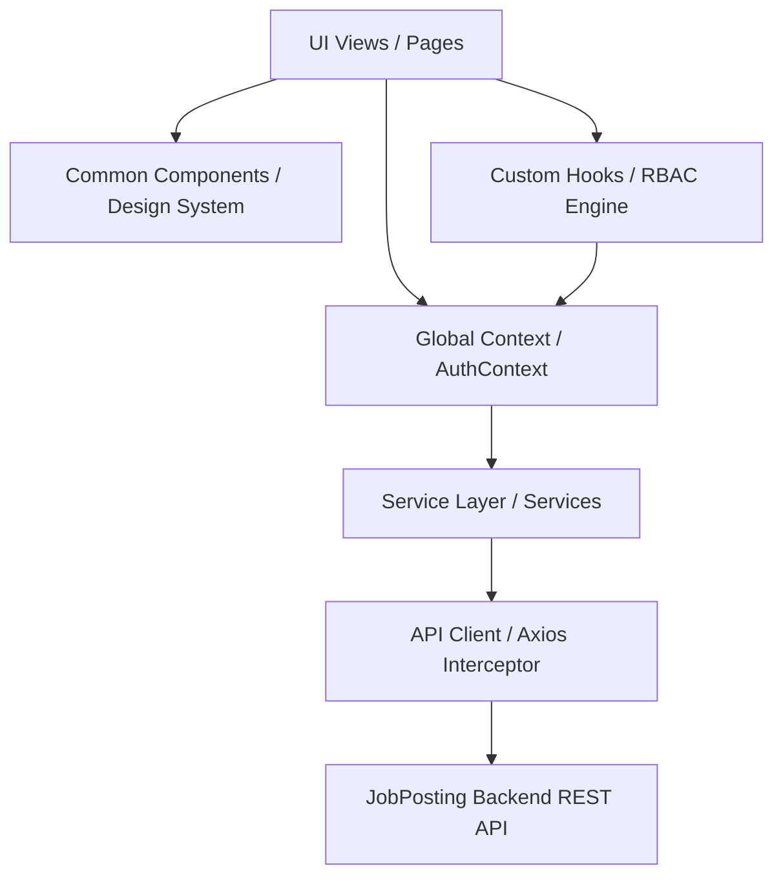
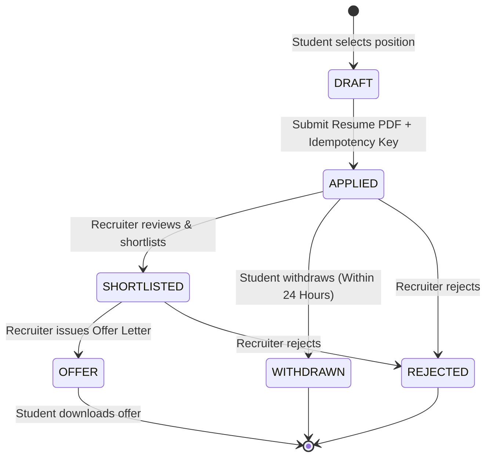
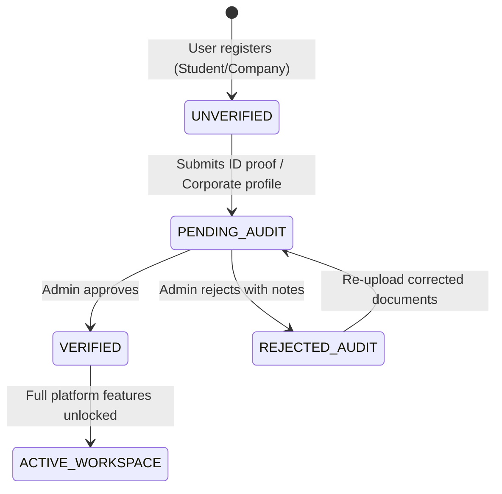
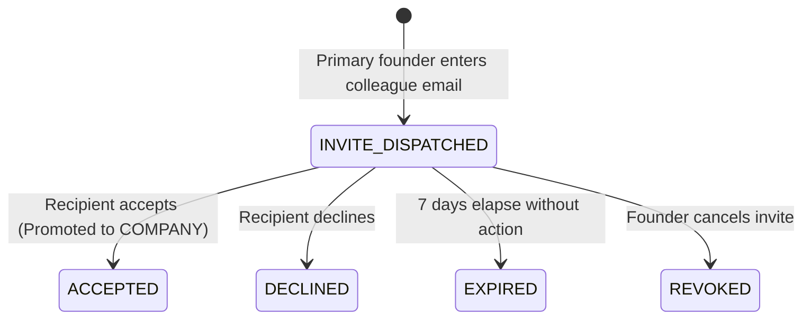

# Frontend Architecture Specification

## 1. Executive Architecture Summary

The **JobPosting** frontend is an enterprise recruitment platform designed and constructed with a modular, layered architecture. It cleanly separates visual presentation, state management, permission governance, and API communications into distinct, single-responsibility layers.

---

## 2. Layered Architecture Overview

### 2.1 Presentation Layer (Pages & Components)
- **Atomic UI Primitives** (`src/components/common`): Pure, reusable visual building blocks (Badge, Button, Card, EmptyState, Input, Modal, Pagination, TableSkeleton, CardSkeleton, Timeline).
- **Workspace Layout Shells** (`src/components/layout`): Dedicated workspace shells for `StudentLayout`, `CompanyLayout`, and `AdminLayout`, providing contextual sidebars, breadcrumbs, search bars, and top-level identity navigation.
- **Domain Feature Pages** (`src/pages/student`, `src/pages/company`, `src/pages/admin`, `src/pages/auth`, `src/pages/common`).

### 2.2 State & Session Layer
- **AuthContext** (`src/context/AuthContext.jsx`): Central store of truth for:
  - User identity, tokens (`accessToken`), role (`STUDENT`, `COMPANY`, `ADMIN`).
  - Verification state (`isVerified`).
  - Linked profiles (`studentProfile`, `companyInfo`).
  - Founder invites queue (`pendingInvites`).
  - Session synchronization & automatic cleanup.

### 2.3 Access Control Layer (RBAC Engine)
- **usePermissions** (`src/hooks/usePermissions.js`): Deterministic authorization rules checking ownership, verification prerequisites, and time windows (e.g. 24-hour application withdrawal rule).
- **ProtectedRoute** (`src/components/protected/ProtectedRoute.jsx`): Router-level guard evaluating role allowlists, profile presence, and verification status before rendering child routes.

### 2.4 Service & Network Layer
- **Service Domain Modules** (`src/services/*.js`): Strict encapsulation of backend REST resources into typed, promise-based API functions.
- **Axios HTTP Client** (`src/services/api.js`):
  - Base URL configuration (`http://localhost:8000/api/v1`).
  - Cross-origin credentials (`withCredentials: true`).
  - Automatic `Bearer` token injection.
  - Idempotency key generation for mutating requests.
  - RFC 7807 problem details error normalization.
  - Transparent 401 token refresh queue.

---

## 3. State Machines & Workflow Lifecycles

### 3.1 Student Application Lifecycle

### 3.2 Verification Audit Lifecycle

### 3.3 Company Founder Invitation Lifecycle

