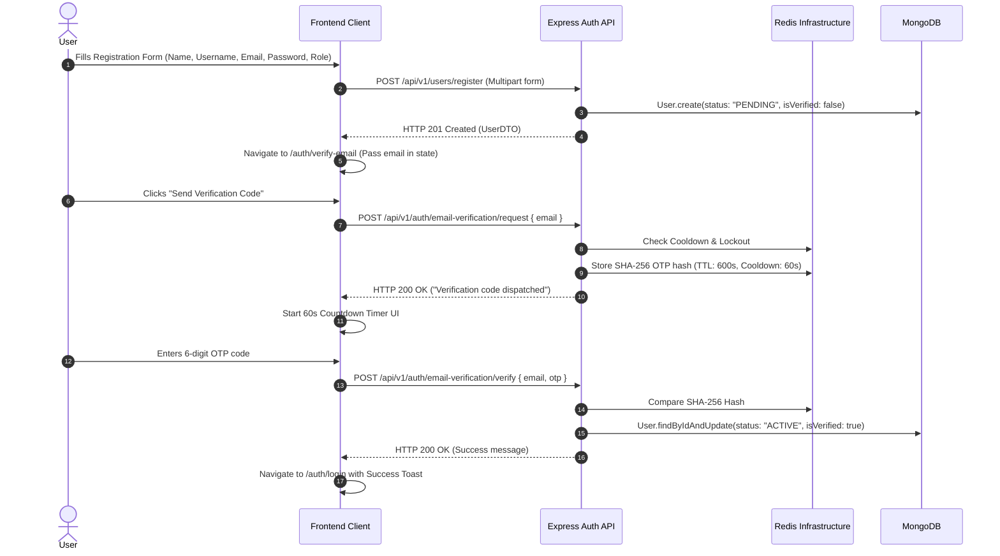
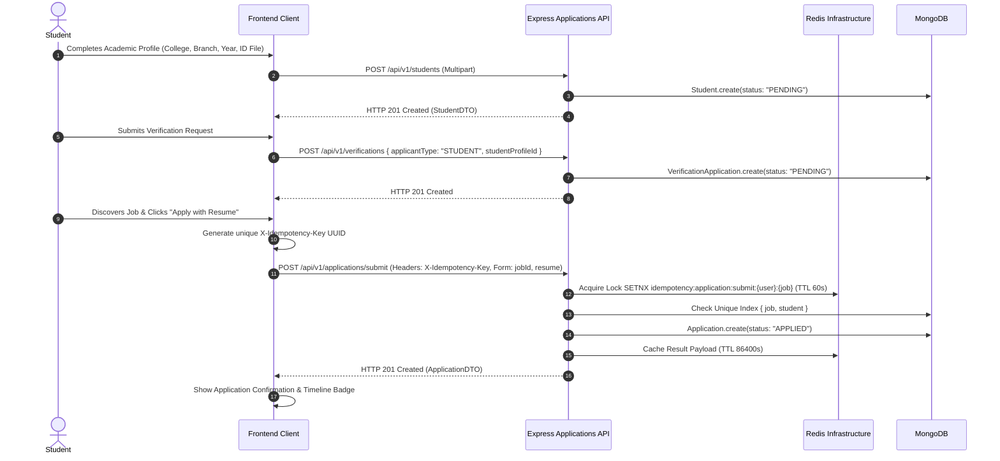
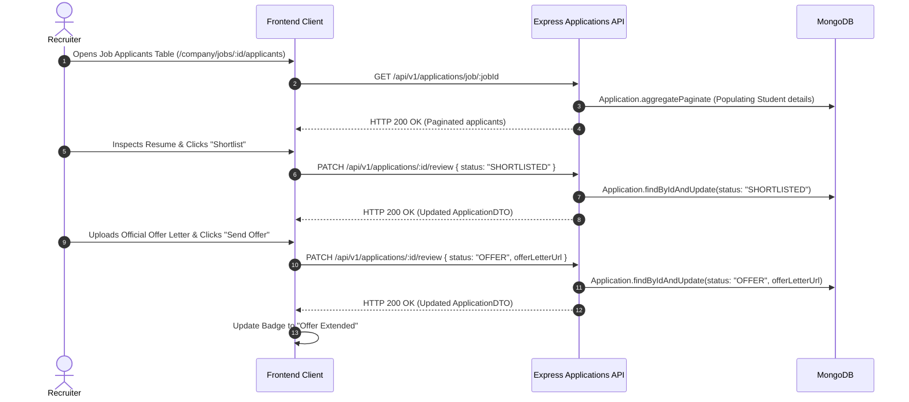
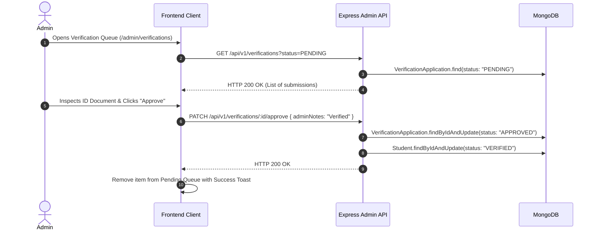

# FRONTEND USER FLOWS & WORKFLOW SPECIFICATIONS

> **Target Application**: `JobPostingFrontend`  
> **Source of Truth**: `JobPostingBackend` Use Cases, Domain State Machines & Repositories  
> **Status**: APPROVED WORKFLOW SPECIFICATION (`VERIFIED`)

---

## 1. AUTHENTICATION & EMAIL VERIFICATION FLOW

---

## 2. STUDENT ONBOARDING & JOB APPLICATION FLOW

---

## 3. COMPANY APPLICANT REVIEW & OFFER ISSUANCE FLOW

---

## 4. ADMIN VERIFICATION & MODERATION FLOW

